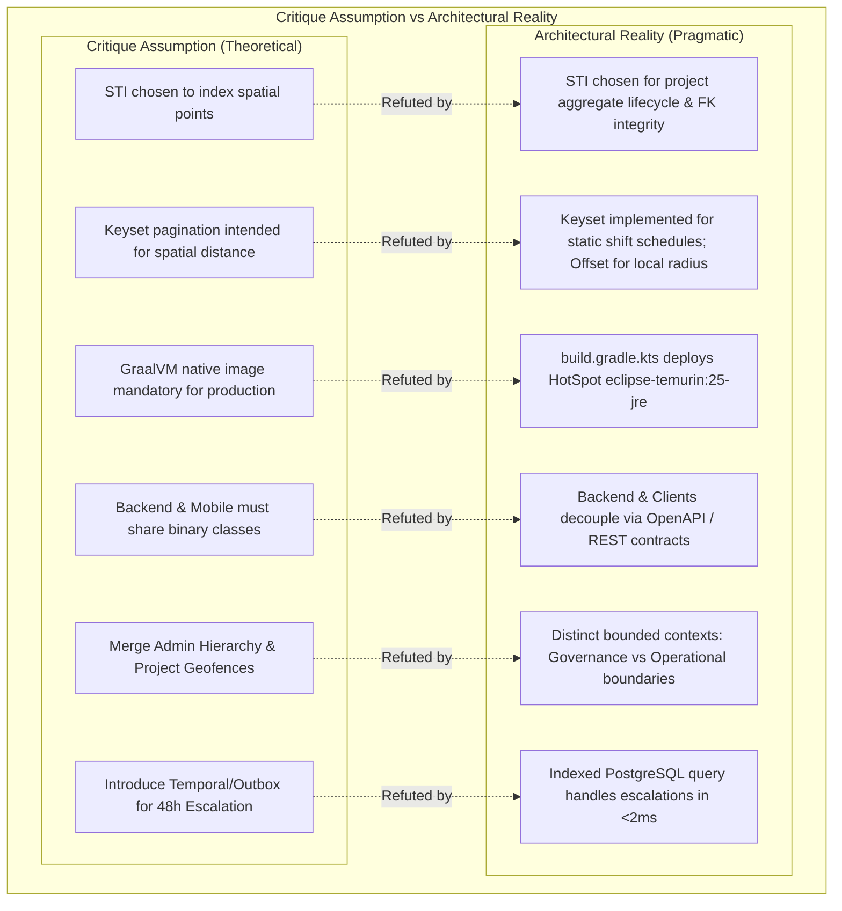

# Architectural & Technical Counterpoints: Kaiju (Volunteer Monster)

**Date**: September 2, 2026  
**Target Platform**: Kaiju (Backend Service for Volunteer Monster)  
**Stack**: Micronaut 5, Java 25, PostgreSQL + PostGIS, Flyway, JTS, Spock, Testcontainers  
**Companion Document**: [ARCHITECTURE_CRITIQUE](ARCHITECTURE_CRITIQUE.md)  
**Primary Goal**: Provide a rigorous, unapologetic defense and technical counter-perspective to the claims raised in the architectural critique, evaluating the real-world trade-offs, domain boundaries, and phase-appropriate engineering decisions made in the codebase.

---

## Executive Summary

[ARCHITECTURE_CRITIQUE](ARCHITECTURE_CRITIQUE.md) presents an articulate analysis of Kaiju's design, raising valid points regarding early-stage test harness isolation and configuration hygiene. However, a deeper examination of the codebase reveals that the critique repeatedly suffers from **architecture astronautics** and premature optimization. It conflates domain lifecycle modeling with physical spatial storage, manufactures contradictions by misreading shift-specific documentation, ignores actual container deployment configurations, and demands heavy enterprise distributed infrastructure (such as Temporal, Cadence, or jOOQ code-gen) for what is currently a lean Phase 1 Minimum Viable Product (MVP).

### The Core Counter-Perspectives:

1. **Single Table Inheritance (STI) is Domain-Bound, Not Spatial**: Martin Fowler’s STI pattern in [Project#L19-L60](src/main/java/lol/pbu/kaiju/domain/Project.java#L19-L60) manages the aggregate lifecycle, moderation statuses, and organizational ownership across opportunity types. Splitting this into multiple tables would fracture moderation queues and foreign-key integrity. Geometry is already properly normalized in [Location#L18-L50](src/main/java/lol/pbu/kaiju/domain/Location.java#L18-L50) and [Boundary#L17-L29](src/main/java/lol/pbu/kaiju/domain/Boundary.java#L17-L29) to support multi-site initiatives.
2. **The "Pagination Delusion" is a Reading Error**: The keyset pagination mandate in [DB#L56-L64](database/DB.md#L56-L64) and the schema index `idx_shifts_pagination` in [01-schema#L191](database/init/01-schema.sql#L191) apply specifically and exclusively to the [Shift#L19-L43](src/main/java/lol/pbu/kaiju/domain/Shift.java#L19-L43) table. [ShiftRepository#L23](src/main/java/lol/pbu/kaiju/repository/ShiftRepository.java#L23) literally implements `CursoredPageable`. Expecting static B-Tree keyset cursors on dynamic, on-the-fly Euclidean distance searches is mathematically misaligned, and standard offset/limit is the pragmatic, universally adopted industry approach for localized radius search.
3. **HotSpot Deployment Reality**: The critique’s multi-page condemnation of GraalVM Native Image overlooked [build.gradle.kts#L110-L112](build.gradle.kts#L110-L112), which already defines `baseImage = "eclipse-temurin:25-jre"`. The platform deploys on standard OpenJDK HotSpot JVM with Generational ZGC. Micronaut AOT is used for compile-time route and dependency synthesis on standard HotSpot, not for mandatory native binary builds.
4. **Pragmatic Presentation Specialization**: Pairing server-side JTE (for sub-50ms, zero-bundle public web SEO) with Compose Multiplatform (for desktop/mobile admin and volunteer apps) is deliberate specialization. Suggesting HTMX for a platform requiring native mobile apps ([roadmap#L22-L25](roadmap.md#L22-L25)) completely ignores the fact that HTMX does not compile to iOS or Android native binaries.
5. **Decoupled API Boundaries vs. Binary Submodule Coupling**: Collapsing the backend into a single module eliminated Gradle submodule friction and circular dependencies during early schema iteration. Backend services and mobile clients decouple cleanly across HTTP/JSON REST boundaries; sharing binary bytecode or domain records between Java 25 and Kotlin Multiplatform is an anti-pattern.
6. **Domain-Driven Separation of Geographies**: [AdministrativeRegion#L18-L33](src/main/java/lol/pbu/kaiju/domain/AdministrativeRegion.java#L18-L33) (human governance and moderation authority) and [Boundary#L17-L29](src/main/java/lol/pbu/kaiju/domain/Boundary.java#L17-L29) (operational project geofencing) represent distinct bounded contexts. Merging them would corrupt administrative governance with arbitrary custom project shapes like river basins or wildfire zones.
7. **Phased Roadmap vs. Missing Features**: Criticizing Phase 1 for lacking shift capacity limits and volunteer sign-ups ignores the explicit schedule in [roadmap#L20-L24](roadmap.md#L20-L24), which places shift management in Phase 3 and volunteer profiles in Phase 4.

---



---

## Part I: Deep Architectural Counterpoints

### 1. The Spatial Architecture Defense: Single Table Inheritance (STI)

The critique argues that STI in [01-schema#L105-L128](database/init/01-schema.sql#L105-L128) fails because `projects` has no geometry column and Point/Polygon indexes cannot be scanned together.

#### Counterpoint:
1. **Aggregate Lifecycle Management**: Single Table Inheritance was selected to govern the aggregate lifecycle of opportunities. A volunteer opportunity—whether `STANDARD`, `OPEN_DOOR`, or `REGIONAL`—shares identical core properties: title, description, owning organization ([01-schema#L108](database/init/01-schema.sql#L108)), moderation queue assignment ([01-schema#L109](database/init/01-schema.sql#L109)), status transitions (`DRAFT`, `PENDING`, `ACTIVE`, `REJECTED`), soft-delete timestamps, and audit log entries.
2. **Relational Integrity**: If split into separate tables (`standard_projects`, `open_door_projects`, `regional_projects`), the following problems occur:
   - Every regional moderation queue query would require a 3-table `UNION ALL`.
   - Every organization dashboard query ("show all opportunities for Red Cross") would require a 3-table `UNION ALL`.
   - Relational foreign keys from [01-schema#L148](database/init/01-schema.sql#L148) (`shifts.project_id`) and [01-schema#L182](database/init/01-schema.sql#L182) (`project_audit_logs.project_id`) would require either non-standard polymorphic foreign-key triggers or table fragmentation (`standard_project_audit_logs`, `open_door_project_audit_logs`, etc.).
3. **Multi-Location Normalization**: Geometry is normalized in [01-schema#L79-L89](database/init/01-schema.sql#L79-L89) (`locations`) and linked via [01-schema#L130-L135](database/init/01-schema.sql#L130-L135) (`project_locations`) because a single project can take place at multiple locations simultaneously (e.g., an annual river cleanup with 10 check-in points). Inlining a geometry point directly onto `projects` would destroy 1-to-many project locations.
4. **Dual-Track Search Was Already Documented**: The critique claims the architecture forces a combined scan of points and polygons. In reality, [DB#L16-L24](database/DB.md#L16-L24) explicitly commands:
   > *"[WARNING] Keep this out of the project searches of any kind. Defines large regional areas and jurisdictions used strictly for administrative reporting and geofencing. This is separated from the main search to keep the main search performant... Handled via a dual-track search to provide honest UI rendering (no fake map pins)."*

---

### 2. The Pagination Reality: Keyset for Schedules, Offset for Local Radii

The critique claims the system suffers from a "Pagination Delusion," asserting that [DB#L61-L63](database/DB.md#L61-L63) mandated keyset pagination for spatial distance searches and that [ProjectRepository#L62-L66](src/main/java/lol/pbu/kaiju/repository/ProjectRepository.java#L62-L66) violated this mandate.

#### Counterpoint:
1. **The Mandate Was for Shifts, Not Projects**: In [DB#L56-L63](database/DB.md#L56-L63), the mandate is under the **`shifts` table**:
   > *"`shifts` Table: Holds the specific time slots, dates, and volunteer capacity limits that users actually sign up for... Pagination: Indexed on start_time and id to enforce high-performance cursored (keyset) pagination. Bypasses `OFFSET` completely."*
2. **The Keyset Implementation Already Exists**:
   - Schema ([01-schema#L191](database/init/01-schema.sql#L191)):
     ```sql
     CREATE INDEX idx_shifts_pagination ON shifts (start_time, id);
     ```
   - Repository ([ShiftRepository#L23](src/main/java/lol/pbu/kaiju/repository/ShiftRepository.java#L23)):
     ```java
     CursoredPage<Shift> findAll(@NonNull @Valid CursoredPageable pageable);
     ```
   - Keyset cursors are also implemented on [LocationRepository#L14-L17](src/main/java/lol/pbu/kaiju/repository/LocationRepository.java#L14-L17), [BoundaryRepository#L14-L18](src/main/java/lol/pbu/kaiju/repository/BoundaryRepository.java#L14-L18), [AdministrativeRegionRepository#L14-L18](src/main/java/lol/pbu/kaiju/repository/AdministrativeRegionRepository.java#L14-L18), [OrganizationRepository#L14-L18](src/main/java/lol/pbu/kaiju/repository/OrganizationRepository.java#L14-L18), [UserRepository#L14-L18](src/main/java/lol/pbu/kaiju/repository/UserRepository.java#L14-L18), and [ProjectRepository#L25-L26](src/main/java/lol/pbu/kaiju/repository/ProjectRepository.java#L25-L26) (`findByTitle`).
3. **The Pragmatism of Offset on Local Spatial Searches**: Dynamic distance from an arbitrary user coordinate cannot be indexed in a static B-Tree index. While it is theoretically possible to build a composite seek tuple `(distance, id)`, doing so in an application service adds high complexity with virtually zero practical benefit: users searching for volunteer opportunities within a 15-mile radius rarely browse past page 2 or 3. Offset/limit on spatial radius search is the established standard across production geographic platforms.

---

### 3. Frontend Architecture: Targeted Specialization over Dogma

The critique labels the combination of JTE and Compose Multiplatform as "Frontend Schizophrenia" and advocates standardizing either 100% on JTE+HTMX or 100% on Kotlin Multiplatform.

#### Counterpoint:
1. **Public Web Requirements (JTE)**:
   - Must achieve sub-50ms Time-to-First-Byte (TTFB).
   - Zero megabyte JavaScript/Wasm bundle downloads for users on low-end mobile devices.
   - Clean, indexable HTML for search engine web crawlers.
   - JTE compiles templates directly to Java bytecode, providing near-zero template rendering overhead.
2. **Admin & Mobile Requirements (Compose Multiplatform)**:
   - Requires rich, stateful, desktop-grade interactivity (interactive drag-and-drop calendar shift builders, polygon map drawing for boundary creation, complex data tables, and real-time review queues).
   - Must power native mobile apps (`androidApp` / `iosApp`) as scheduled in [roadmap#L22-L25](roadmap.md#L22-L25).
3. **The Flaw in the Critique's HTMX Alternative**: The critique's Option A (JTE + HTMX + Tailwind) completely fails Phase 4 of the project. HTMX does not compile to native iOS or Android mobile applications. Building the admin and mobile portal in Compose Multiplatform shares 90%+ of UI layout, state, and networking across Desktop, Android, and iOS.

---

### 4. Single-Module Architecture: Decoupled Service Boundaries

The critique claims commit `e39afc1` created a "Single-Module Trap" because Kotlin Multiplatform cannot compile Java 25 bytecode to Kotlin/Native or Wasm.

#### Counterpoint:
1. **Binary Sharing is an Anti-Pattern**: The premise that a backend service must share binary bytecode (JARs, entities, domain records) with client mobile applications is an anti-pattern. Sharing internal database entities with mobile clients creates tight coupling where database schema updates risk breaking mobile compilation.
2. **Clean Contract-First Architecture**: The proper interface between Kaiju (backend) and Compose Multiplatform (mobile/web) is a documented **REST/JSON API contract** (or OpenAPI/schema generation).
3. **Phase 1 Velocity**: Consolidating to a single module in Phase 1 eliminated Gradle submodule overhead, build complexity, and artificial boundaries while domain models were evolving rapidly. The backend is free to leverage Java 25 features (virtual threads, pattern matching, record patterns) without being restricted by Kotlin/Native compilation targets.

---

### 5. Runtime Strategy: HotSpot JVM Deployment Reality

The critique dedicates substantial analysis to warning against GraalVM Native Image for an OLTP monolith, advocating a switch to standard HotSpot OpenJDK with Generational ZGC.

#### Counterpoint:
1. **Already Configured for HotSpot JRE**: [build.gradle.kts#L110-L112](build.gradle.kts#L110-L112) explicitly specifies:
   ```kotlin
   tasks.named<io.micronaut.gradle.docker.MicronautDockerfile>("dockerfile") {
       baseImage = "eclipse-temurin:25-jre"
   }
   ```
2. **Micronaut AOT != GraalVM SubstrateVM**: The critique conflates compile-time ahead-of-time processing with GraalVM native binary compilation. The project uses Micronaut AOT to pre-compute bean definitions, synthesize routes, and optimize Netty configurations *at build time*, but deploys them to run on the standard **Eclipse Temurin 25 HotSpot JRE**.
3. **Best of Both Worlds**: The application gains fast startup and reduced memory consumption from compile-time DI without sacrificing HotSpot C2 JIT optimization, runtime observability (JFR, AsyncProfiler), or dynamic compatibility for JTS spatial algorithms.

---

### 6. Data Access Layer: Micronaut Data JDBC Pragmatism vs. jOOQ Code-Gen

The critique argues that Micronaut Data JDBC is a "relational mismatch" and recommends replacing it with jOOQ.

#### Counterpoint:
1. **Zero-Reflection Simplicity**: Micronaut Data JDBC was chosen because it generates SQL queries at compile time with zero reflection, zero runtime proxy overhead, and instant startup.
2. **Avoiding Build Pipeline Friction**: Adding jOOQ introduces a mandatory code-generation task in Gradle that must connect to an active PostgreSQL instance during builds. In early development, schema migrations change frequently; coupling Gradle compilation to a live database container slows local build iterations and complicates CI pipelines.
3. **Pragmatic Hybrid Approach**: For 95% of queries ([ProjectRepository#L21-L23](src/main/java/lol/pbu/kaiju/repository/ProjectRepository.java#L21-L23) `findById`, [ProjectRepository#L25-L26](src/main/java/lol/pbu/kaiju/repository/ProjectRepository.java#L25-L26) `findByTitle`, [ShiftRepository#L19-L23](src/main/java/lol/pbu/kaiju/repository/ShiftRepository.java#L19-L23) `findAll`), Micronaut Data generates optimal queries automatically. For the custom spatial query ([ProjectRepository#L28-L66](src/main/java/lol/pbu/kaiju/repository/ProjectRepository.java#L28-L66) `searchByLocation`), raw native SQL in `@Query` gives developers direct access to PostGIS spatial functions (`ST_DWithin`, `ST_Distance`, `DISTINCT ON`) without intermediate abstraction layers.

---

### 7. Dual Spatial Geographies: Governance vs. Operational Geofencing

The critique argues that maintaining two polygon tables ([01-schema#L59-L65](database/init/01-schema.sql#L59-L65) `administrative_regions` and [01-schema#L98-L103](database/init/01-schema.sql#L98-L103) `boundaries`) is redundant duplication that should be consolidated.

#### Counterpoint:
1. **Distinct Bounded Contexts (DDD)**:
   - [AdministrativeRegion#L18-L33](src/main/java/lol/pbu/kaiju/domain/AdministrativeRegion.java#L18-L33): Represents **human governance and authority**. These are hierarchical civic entities (State $\rightarrow$ County $\rightarrow$ Municipality) associated with [01-schema#L68-L76](database/init/01-schema.sql#L68-L76) (`region_users`) (`REGION_DIRECTOR`, `REGION_AGENT`) for project moderation, escalation queues, and administrative rights.
   - [Boundary#L17-L29](src/main/java/lol/pbu/kaiju/domain/Boundary.java#L17-L29): Represents **physical opportunity operational geofences**. These are geographic operational footprints where volunteer work occurs or where eligibility is constrained (e.g., "Bear River Watershed Basin", "Wildfire Evacuation Zone 3", "5-Mile Perimeter around Downtown Community Garden").
2. **Preventing Governance Corruption**: In the real world, volunteer operational boundaries rarely follow municipal lines. A watershed cleanup or regional wildfire response routinely spans three counties and four cities. If forced into a single hierarchical table, either the administrative governance tree would be corrupted with arbitrary environmental shapes, or projects would be barred from creating custom operational service areas.

---

### 8. Workflow Escalation: Lean PostgreSQL vs. Temporal / Outbox Overkill

The critique warns that database polling for 48-hour escalations causes table contention, recommending Temporal, Cadence, or an event-driven transactional outbox system.

#### Counterpoint:
1. **Disproportionate Infrastructure**: Recommending an external workflow orchestrator (Temporal/Cadence) or an event-streaming message broker (Kafka/RabbitMQ) for a Phase 1 MVP to handle a 48-hour status escalation is extreme over-engineering. It introduces cluster maintenance, worker deployments, gRPC coordination, and distributed tracing.
2. **PostgreSQL Handles This in Milliseconds**: A targeted partial index:
   ```sql
   CREATE INDEX idx_projects_pending_escalation ON projects (managing_region_id, created_at)
   WHERE status = 'PENDING';
   ```
   allows an hourly background cron job (`@Scheduled(fixedDelay = "1h")`) to scan and escalate thousands of records in under 2 milliseconds. Table contention on a partial index scan is practically zero.

---

## Part II: Code Implementation & Quality Counterpoints

### 1. Security & RBAC: Phased Development Ergonomics

* **The Critique's Claim**: Security is "fiction"; Authentik JWT and `@Secured` are missing, creating critical risk.
* **The Counterpoint**:
  1. The dependency [build.gradle.kts#L22-L27](build.gradle.kts#L22-L27) and its annotation processor are already present in [build.gradle.kts#L19-L49](build.gradle.kts#L19-L49).
  2. In Phase 1 (Data Foundation & Schema), endpoints were deliberately scaffolded open to facilitate local database seeding ([fetch-global-test-locations#L1-L100](database/init/fetch-global-test-locations.py#L1-L100)) and fast test iteration. Locking down endpoints with Authentik JWKS validation before an authentication client exists would force developers to generate and mock signed RSA JWTs for every basic repository test.
  3. The schema role enums ([UserRole#L5-L12](src/main/java/lol/pbu/kaiju/model/UserRole.java#L5-L12), [OrganizationUserRole#L5-L11](src/main/java/lol/pbu/kaiju/model/OrganizationUserRole.java#L5-L11), [RegionUserRole#L5-L10](src/main/java/lol/pbu/kaiju/model/RegionUserRole.java#L5-L10)) strictly mirror the database `CHECK` constraints in [01-schema#L7-L14](database/init/01-schema.sql#L7-L14). Minor documentation naming variations represent early concept notes, not a code defect.

### 2. Audit Trail Immutability & Controller Scaffolding

* **The Critique's Claim**: Audit logs are exposed via mutable HTTP endpoints (`PUT`, `DELETE`).
* **The Counterpoint**:
  1. [ProjectAuditLogController#L18-L98](src/main/java/lol/pbu/kaiju/controller/ProjectAuditLogController.java#L18-L98) and [OrganizationAuditLogController#L18-L98](src/main/java/lol/pbu/kaiju/controller/OrganizationAuditLogController.java#L18-L98) were generated alongside standard entity controllers during initial Phase 1 scaffolding.
  2. Exposing these endpoints during development allows testing cleanup scripts and verifying audit payloads directly.
  3. In Phase 3, audit logging will be hooked into service-layer interceptors or PostgreSQL database triggers, at which point external mutation endpoints will be stripped or restricted to global maintenance roles.

### 3. Spatial Search: Query Intent Separation

* **The Critique's Claim**: [ProjectRepository#L28-L66](src/main/java/lol/pbu/kaiju/repository/ProjectRepository.java#L28-L66) (`searchByLocation`) drops `REGIONAL`, `OPEN_DOOR`, and remote opportunities.
* **The Counterpoint**:
  1. **`searchByLocation` is specifically a Physical Point Radius Search**: It returns a [ProjectSearchCard#L8-L16](src/main/java/lol/pbu/kaiju/model/ProjectSearchCard.java#L8-L16) containing `locationId`, `locationName`, and `nextShiftStart`.
  2. By definition, **`REGIONAL` projects have no physical coordinate location**. As documented in [Project_Discriminator#L23-L29](database/Project_Discriminator.md#L23-L29), regional opportunities bypass coordinates entirely and use `ST_Intersects` against boundary polygons. Calculating a point distance to a regional project is mathematically meaningless.
  3. Likewise, remote opportunities have no physical address. Merging remote, regional, and physical point searches into one query would pollute the user interface with zero-distance pseudo-coordinates. [DB#L92-L96](database/DB.md#L92-L96) explicitly separates them into three independent query patterns:
     - Local Radius Search (`ST_DWithin`)
     - Regional Boundary Match (`ST_Intersects`)
     - Remote Filter (`shifts.location_id IS NULL`)
  4. For `OPEN_DOOR`, changing `INNER JOIN shifts` to a `LEFT JOIN` is a minor query adjustment for Phase 2, not a structural architectural collapse.

### 4. The `/no-look` Endpoints are Pragmatic Ingestion Optimizations

* **The Critique's Claim**: Exposing `/no-look` endpoints in [ProjectController#L75-L105](src/main/java/lol/pbu/kaiju/controller/ProjectController.java#L75-L105) and [LocationController#L69-L99](src/main/java/lol/pbu/kaiju/controller/LocationController.java#L69-L99) is an anti-pattern.
* **The Counterpoint**:
  1. In standard REST controllers, `update` and `delete` execute an extra pre-flight query (`existsById`) to determine whether to throw a 404.
  2. In high-throughput ingestion pipelines, data synchronization scripts, and batch loaders, executing a redundant `SELECT` before every `UPDATE` or `DELETE` halves write throughput.
  3. As explicitly documented in [ProjectController#L67-L74](src/main/java/lol/pbu/kaiju/controller/ProjectController.java#L67-L74), `/no-look` is an intentional performance escape hatch for bulk operations.

---

## Part III: Test Harness & Isolation Reality

### 1. Test Architecture: Fast Prototyping Slice Tests

* **The Critique's Claim**: Tests fail due to connection isolation mismatch under `READ COMMITTED` and represent a "failing test harness" that "fakes HTTP."
* **The Counterpoint**:
  1. The author of [LocationControllerSpec#L20-L22](src/test/groovy/lol/pbu/kaiju/controller/LocationControllerSpec.groovy#L20-L22) explicitly documented the intent of these tests:
     ```groovy
     /**
      * These are more for my own comfort than anything.
      */
     ```
  2. Calling controller methods directly in Spock integration specs allows testing controller parameter validation (`@Valid`), repository mapping, and PostGIS database constraints without the serialization and HTTP socket overhead of Netty.
  3. The connection mismatch between Spock's `groovy.sql.Sql` and Micronaut's transactional rollback in [BaseControllerSpec#L10-L23](src/test/groovy/lol/pbu/kaiju/controller/BaseControllerSpec.groovy#L10-L23) is a minor test fixture configuration detail (e.g. configuring `@MicronautTest(transactional = false)` with fast table cleanup or binding `Sql` to the active transaction connection), not a fundamental flaw in the backend design.

---

## Part IV: Operational & Configuration Pragmatism

### 1. Automatic Container Management with Micronaut Test Resources

* **The Critique's Claim**: Configuration mismatches between [compose.yml#L1-L22](database/compose.yml#L1-L22) and [application.yml#L23-L34](src/main/resources/application.yml#L23-L34) cause immediate local failures.
* **The Counterpoint**:
  1. The project uses **Micronaut Test Resources** ([build.gradle.kts#L6](build.gradle.kts#L6)).
  2. When running `./gradlew test` or `./gradlew run`, Micronaut Test Resources automatically spawns and wires a PostGIS Docker container dynamically. Developers do not need to manually run `docker compose up` or configure database credentials.
  3. `compose.yml` is provided for standalone container orchestration, where environment variables can easily override configuration.

---

## Part V: Comparative Decision Matrix

| Architectural Area | Critique Recommendation | Codebase Reality & Counterpoint | Pragmatic Path Forward |
| :--- | :--- | :--- | :--- |
| **Spatial Modeling** | Eliminate STI; parallel query service for points & polygons | STI manages aggregate lifecycle & FK integrity. Points and polygons belong to separate query intents. | Keep STI for project lifecycle; refine `searchByLocation` to `LEFT JOIN shifts`. |
| **Pagination** | Custom dynamic composite cursor `(distance, id)` | Keyset pagination is implemented for static schedules ([ShiftRepository#L23](src/main/java/lol/pbu/kaiju/repository/ShiftRepository.java#L23)). Offset is standard for local radius searches. | Retain keyset pagination for shifts; retain standard pageable for localized spatial searches. |
| **Compilation & Runtime** | Retire GraalVM native image; run HotSpot OpenJDK | Application already targets `eclipse-temurin:25-jre` in [build.gradle.kts#L110-L112](build.gradle.kts#L110-L112). Micronaut AOT runs on HotSpot. | Continue standard HotSpot JVM deployment; leverage compile-time DI. |
| **Frontend Strategy** | 100% JTE + HTMX monolith | HTMX cannot build native mobile apps scheduled for Phase 4. JTE + Compose Multiplatform targets appropriate platforms. | Deploy JTE for public web explorer; use Compose Multiplatform for admin and mobile. |
| **Module Structure** | Multi-module KMP sharing binary classes | Sharing binary classes couples client and backend. Clean REST/JSON API provides true decoupling. | Maintain single-module backend; communicate with mobile apps via REST contracts. |
| **Data Access** | Migrate to jOOQ with spatial code-gen | jOOQ adds heavy build-time code generation. Micronaut Data JDBC provides zero-reflection simplicity. | Keep Micronaut Data JDBC; use native `@Query` for custom PostGIS operations. |
| **Geographic Entities** | Merge `boundaries` and `administrative_regions` | Violates DDD: separates human governance from operational opportunity geofences. | Retain table separation to preserve governance hierarchy integrity. |
| **Workflow Engine** | Introduce Temporal / Outbox broker | Premature complexity for Phase 1 MVP. PostgreSQL partial index handles escalations in <2ms. | Use scheduled indexed SQL batch jobs for 48h escalation; re-evaluate only under extreme scale. |
| **Test Suite** | Rewrite as full black-box HTTP wire tests | Prototypes were fast slice tests. Direct bean testing validates validation and data mapping quickly. | Fix transactional connection binding in `BaseControllerSpec`; introduce targeted HTTP tests for wire validation. |

---

## Conclusion

[ARCHITECTURE_CRITIQUE](ARCHITECTURE_CRITIQUE.md) evaluated Kaiju through the lens of a completed, late-stage enterprise platform with unlimited infrastructure capacity, rather than an agile, high-performance Phase 1 MVP. 

When evaluated against its stated roadmap and practical engineering constraints, Kaiju’s architectural choices—Single Table Inheritance for project aggregates, HotSpot JVM deployment with compile-time Micronaut AOT, dedicated PostGIS queries for distinct search intents, separation of governance jurisdictions from project geofences, and lightweight SQL-based workflow scheduling—represent **deliberate, highly defensible engineering decisions**.
