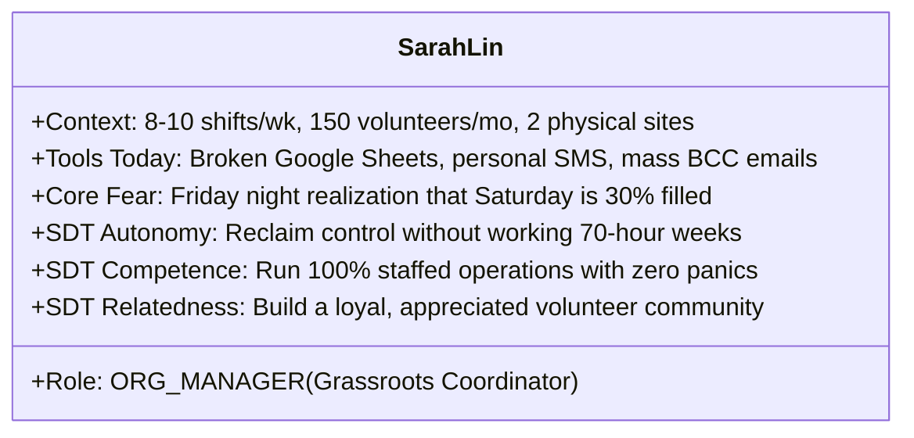
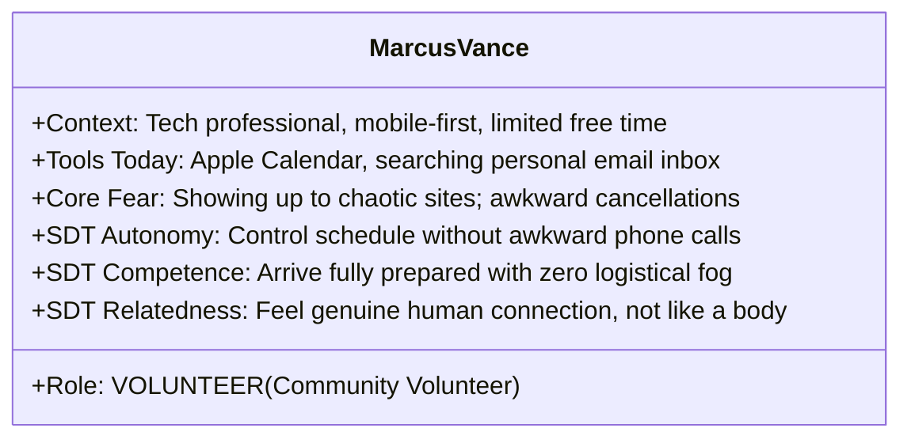
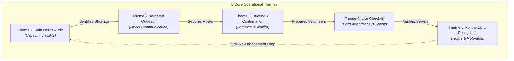

# User Personas & Human Need Statements: Volunteer Management

**Companion Document**: [ARCHITECTURE_SYNTHESIS.md](../ARCHITECTURE_SYNTHESIS.md)  
**Methodological Framework**: Nielsen Norman Group (NN/g) Persona Anatomy & 3-Part User Need Statement Standard  
**Target Platform**: Kaiju (Volunteer Monster)  
**Visual Artifacts**:
* **Editable draw.io Diagram**: [user-needs-and-personas.drawio](./diagrams/user-needs-and-personas.drawio)
* **High-Resolution Vector SVG**: [user-needs-and-personas.svg](./diagrams/user-needs-and-personas.svg)
* **High-Resolution PNG Render**: [user-needs-and-personas.png](./diagrams/user-needs-and-personas.png)

---

## 1. Executive Summary: Grounding the "Human Half"

In [ARCHITECTURE_SYNTHESIS.md Part IX](../ARCHITECTURE_SYNTHESIS.md#L299-L368), Kaiju was evaluated as having built an elite **Spatial Discovery Engine** (geospatial indexing, radius search, normalized geometry boundaries), but having not yet tackled the **"Human Half"** of the platform: **Volunteer Management**.

Before jumping into database migrations, state machines, or system architectures, user experience design mandates that we first understand the **human beings** who inhabit this system:
* What drives someone to give up their Saturday morning to plant trees or pack food boxes?
* What cognitive overload crushes a grassroots coordinator who is trying to keep an urban pantry staffed?
* What anxieties cause a well-meaning volunteer to freeze, cancel, or quietly no-show?

This document applies the **Nielsen Norman Group (NN/g)** frameworks for **Behavioral Personas**, **3-Part User Need Statements**, and **Self-Determination Theory (SDT)** to establish a qualitative foundation for Kaiju’s volunteer management capabilities.

---

## 2. NN/g Methodological Foundations

### 2.1 NN/g Persona Principles: Behaviors Over Demographics

According to NN/g research:
1. **Personas must capture behavioral variables**: Age, location, and salary provide context, but how a person behaves under stress, how they communicate, how they manage time, and their tech habits dictate the software experience.
2. **Personas must serve as empathy-inducing shorthand**: They prevent teams from designing for an idealized, hypothetical "elastic user" who reads every email and never has life emergencies.
3. **Personas must highlight workarounds**: Understanding how users currently solve problems (hacked spreadsheets, panic group texts, paper clipboards) reveals true unmet needs.

### 2.2 The NN/g 3-Part User Need Statement Formula

NN/g defines user need statements (problem statements / POV statements) using a strict 3-part formula:

```
[A specific user / persona] needs [need (VERB, not a noun)] in order to accomplish [goal / human insight].
```

* **Focus on Verbs, Not Nouns**: Features and UI widgets (e.g. "a dashboard", "a dropdown", "a calendar") are solutions, not needs. The need must capture the human action and intent (e.g., *"evaluate capacity deficits at a glance"*).
* **Deep Purpose / Insight**: The *"in order to"* clause must articulate the emotional, social, or operational payoff for the human being, establishing the metric against which any technical solution must be judged.

### 2.3 Self-Determination Theory (SDT) in UX

NN/g highlights Edward Deci & Richard Ryan’s Self-Determination Theory to explain intrinsic motivation in software adoption:
* **Autonomy**: Feeling in control of one's choices, time, and commitments without feeling coerced or micromanaged.
* **Competence**: Feeling capable, well-prepared, and effective in executing a task.
* **Relatedness**: Feeling belonging, mutual respect, and genuine human connection with a community.

---

## 3. Core Behavioral Personas

```mermaid
graph LR
    subgraph "The Human Ecosystem of Volunteer Management"
        A["Sarah Lin<br/><b>Grassroots Coordinator</b><br/><i>(The Manager)</i>"] 
        <-->|Direct Liaison & Briefing| 
        B["Marcus Vance<br/><b>Committed Volunteer</b><br/><i>(The Participant)</i>"]

        A <-->|Delegated Field Operations| C["David O'Connor<br/><b>Boots-on-the-Ground Lead</b><br/><i>(The Site Captain)</i>"]
        C <-->|On-Site Greeting & Scan| B

        A <-->|Service Hours Validation| D["Elena Rodriguez<br/><b>Credit-Seeking Student</b><br/><i>(The Milestone Seeker)</i>"]
        C <-->|Attendance Verification| D
    end
```

---

### Persona 1: Sarah Lin — "The Overwhelmed Grassroots Coordinator"

* **Platform Role**: `ORG_MANAGER` / `ORG_ADMIN`
* **Archetype**: Grassroots Community Project Coordinator
* **Organization**: *Urban Harvest Food Pantry* (Community-supported food rescue & urban farming initiative)
* **Quote**:
  > *"I spend more time chasing unconfirmed volunteers on spreadsheets and sending individual text messages than I do actually running our food distribution."*



#### Biographical Context

Sarah is a full-time coordinator at a small non-profit operating on a shoestring budget. She coordinates fresh food distribution, cold-storage sorting, and weekend garden maintenance. She operates between a cluttered office desk (laptop) and chaotic loading docks (smartphone).

#### Daily Behaviors & Workarounds

* Maintains a massive, color-coded Google Sheet where rows frequently get misaligned or overwritten by co-workers.
* Sends mass BCC emails on Mondays that often get flagged as spam or ignored by volunteers.
* Copies volunteer mobile numbers into her personal phone to send individual text reminders on Friday evening: *"Hi Marcus, are you still good for tomorrow morning at 9am?"*
* When volunteers ghost on Saturday morning, she and her fellow staff members end up doing back-breaking manual labor themselves to make up the deficit.

#### Psychological Drivers (SDT)

* **Autonomy**: Desperately needs operational predictability and breathing room, rather than living in constant triage mode.
* **Competence**: Takes pride in feeding families; feels demoralized when logistical chaos prevents food from reaching community members.
* **Relatedness**: Loves her community; wants volunteers to feel like family, but exhaustion leaves her zero energy for post-event follow-up.

#### Frictions & Anxieties

1. **Spreadsheet Blindness**: Discovering an unfilled shift 12 hours before start time, when it is too late to recruit.
2. **The 30–50% Ghosting Rate**: The painful reality that half of registered volunteers simply never show up.
3. **Communication Burnout**: Spending 3+ hours every Thursday and Friday answering the same questions: *"Where do I park?"*, *"Can I wear sandals?"*, *"What gate do I go to?"*
4. **Post-Shift Guilt**: Collapsing at home on Saturday afternoon without sending thank-you notes, knowing volunteers will slowly drift away.

---

### Persona 2: Marcus Vance — "The Purpose-Driven Professional"

* **Platform Role**: `VOLUNTEER`
* **Archetype**: Dedicated Community Volunteer
* **Life Situation**: 32, Senior UX Consultant; lives in an urban apartment; volunteers 1–2 Saturdays a month.
* **Quote**:
  > *"I genuinely want to help my local community, but if I don't know where to park, what to wear, or who to look for, the anxiety makes me want to stay home."*



#### Biographical Context

Marcus spends 50 hours a week in corporate design meetings. Volunteering is his way to disconnect from screens, get his hands dirty, and give back to his neighborhood. He is strictly mobile-first outside work hours and rarely checks his personal desktop email on weekends.

#### Daily Behaviors & Workarounds

* Browses community opportunities on his phone when inspired, usually 2–3 weeks in advance.
* Adds shifts to his calendar, but routinely misplaces the exact address or gate instructions.
* 30 minutes before leaving home, he searches his email inbox for keywords like *"food bank"*, *"volunteer"*, or *"parking"*.
* If a work deadline or illness hits on Friday night, he feels dread and guilt about cancelling. Because there is no simple way to cancel without writing an awkward email or calling an unknown coordinator, he sometimes commits the sin of ghosting.

#### Psychological Drivers (SDT)

* **Autonomy**: Wants the freedom to volunteer when his demanding schedule permits, with effortless self-service management.
* **Competence**: Needs clear expectations so he feels capable, useful, and properly equipped on site.
* **Relatedness**: Wants to meet neighbors, work alongside passionate coordinators, and feel that his 4 hours of physical effort actually mattered.

#### Frictions & Anxieties

1. **Logistical Fog**: Showing up at a warehouse district with locked fences, no signage, no parking instructions, and no phone number to call.
2. **Cancellation Friction & Guilt**: The painful emotional hurdle of cancelling when life happens, leading to avoidance and no-shows.
3. **The Recognition Void**: Sweating for 4 hours carrying 40-lb crates, saying goodbye to a distracted staff member, and never receiving a single follow-up message or impact update.

---

### Persona 3: Elena Rodriguez — "The Milestone & Credit Seeker"

* **Platform Role**: `VOLUNTEER`
* **Archetype**: High School Senior / Scholarship Seeker
* **Life Situation**: 17; needs 40 certified service hours for graduation and college financial aid.
* **Quote**:
  > *"I completed 16 hours last month, but the paper slip got soaked in the rain, and the coordinator hasn't replied to my emails to sign a new one."*

#### Context & Behaviors

* Strictly smartphone-based (SMS, Instagram, TikTok); views email as an outdated administrative tool.
* Must balance school, part-time work, and sports; needs shifts that fit tight time windows.
* Carries crumpled school paper verification forms to volunteer events; feels anxious about losing credit.

#### Frictions & Anxieties

* **Lost Paper Records**: Coordinators losing paper attendance clipboards or forgetting who was on site.
* **Administrative Delays**: Waiting 3 weeks for an overworked coordinator to sign an hours confirmation letter.
* **Unclear Requirements**: Showing up to a shift only to find minors are not permitted without notarized parental waivers.

---

### Persona 4: David O'Connor — "The Boots-on-the-Ground Lead"

* **Platform Role**: `ORG_MEMBER` / Field Captain
* **Archetype**: Veteran Volunteer Site Captain
* **Life Situation**: 58, retired contractor; trusted volunteer lead who runs off-site Saturday cleanups.
* **Quote**:
  > *"When 15 people arrive at a muddy park at 8:00 AM, I need to know in 10 seconds who is here and who has allergies—without clipboards in the rain."*

#### Context & Behaviors

* Directs physical work in the field while Sarah manages central warehouse logistics.
* Operates in cold, wet, or bright-sunlight conditions where typing on small touchscreens is difficult.
* Needs immediate access to emergency contact phone numbers if a volunteer injures themselves.

#### Frictions & Anxieties

* **Illegible Paper Rosters**: Trying to decipher smeared volunteer handwriting and misspelled phone numbers on paper clipboards.
* **The Delayed-vs-Ghosting Dilemma**: Wondering whether to delay the safety briefing for 3 missing volunteers, not knowing if they are parking or never coming.

---

## 4. Operational Human Need Themes & NN/g Need Statements

Following the Nielsen Norman Group's **3-Part Formula** (`[User]` needs `[Need (Verb)]` in order to accomplish `[Goal / Human Insight]`), the following need statements define the core requirements for managing volunteers:



---

### Theme 1: Shift Deficit Review & Capacity Visibility

*Focus: Helping coordinators see staffing shortages with sufficient lead time, rather than in the eleventh hour.*

#### Need Statement 1 (Sarah · Coordinator)

> **Sarah needs to evaluate real-time shift capacity fill rates against minimum staffing thresholds days in advance in order to proactively identify critical service shortages before community operations are compromised.**
* *NN/g Rule Check*: The need is a verb (*"evaluate fill rates"*), not a noun (*"a dashboard"*).
* *Psychological Pillar*: **Autonomy** — Replaces stressful last-minute panic with calm operational control.

#### Need Statement 2 (Sarah · Coordinator)

> **Sarah needs to distinguish between specialized role shortages (e.g. box truck drivers, bilingual leads) and general headcount needs in order to target recruitment efforts toward specific qualifications rather than blasting generic pleas.**
* *NN/g Rule Check*: The need is a verb (*"distinguish role shortages"*), not a feature (*"role tags"*).
* *Psychological Pillar*: **Competence** — Ensures operational readiness and qualified coverage.

#### Need Statement 3 (Marcus · Volunteer)

> **Marcus needs to discover where his presence is most urgently needed in his neighborhood in order to direct his scarce weekend time toward high-impact community causes.**
* *NN/g Rule Check*: Focuses on *"discover where his presence is urgently needed"*.
* *Psychological Pillar*: **Relatedness & Purpose** — Connects personal sacrifice with real civic urgency.

---

### Theme 2: Targeted Outreach & Direct Communication

*Focus: Communicating with candidate pools and confirmed volunteers rapidly without broadcast fatigue.*

#### Need Statement 4 (Sarah · Coordinator)

> **Sarah needs to broadcast high-urgency, contextual outreach across mobile channels (SMS/WhatsApp) to nearby qualified candidate pools in order to fill empty slots quickly without fatiguing her broader community with irrelevant blasts.**
* *NN/g Rule Check*: Focuses on *"broadcast contextual outreach"*, not a software mass-mailer.
* *Psychological Pillar*: **Autonomy** — Bridges the communication chasm directly to mobile devices without spreadsheet phone tag.

#### Need Statement 5 (Marcus · Volunteer)

> **Marcus needs to claim an open shift slot or release an existing commitment with a single frictionless mobile tap in order to manage his civic schedule responsibly without guilt or cumbersome authentication barriers.**
* *NN/g Rule Check*: Focuses on *"claim or release commitment with a single tap"*, not a password login screen.
* *Psychological Pillar*: **Autonomy** — Treats the volunteer as an efficient human with limited attention.

---

### Theme 3: Pre-Shift Logistics & RSVP Confirmation

*Focus: Mitigating the 30–50% no-show rate through timely logistics and automated waitlists.*

#### Need Statement 6 (Marcus · Volunteer)

> **Marcus needs to receive concise, timely arrival instructions (parking, attire, weather, site lead contact) on his mobile device 24–48 hours prior to a shift in order to feel confident, adequately prepared, and calm on event morning.**
* *NN/g Rule Check*: Focuses on *"receive arrival instructions"*, not a PDF attachment.
* *Psychological Pillar*: **Competence & Psychological Safety** — Eliminates arrival disorientation and anxiety.

#### Need Statement 7 (Sarah · Coordinator)

> **Sarah needs to obtain definitive attendance confirmations and automatically backfill cancellations from a waitlist in order to prevent silent volunteer ghosting and avoid fielding understaffed operations.**
* *NN/g Rule Check*: Focuses on *"obtain confirmations and backfill cancellations"*, not a manual waitlist table.
* *Psychological Pillar*: **Autonomy** — Automated safety nets protect the coordinator from being left stranded.

---

### Theme 4: Live On-Site Attendance & Field Safety

*Focus: Eliminating paper clipboards, verifying arrival in seconds, and protecting duty of care.*

#### Need Statement 8 (David · Field Lead)

> **David needs to verify volunteer arrivals in seconds using mobile field tools and access critical emergency contacts instantly in order to start operations on time and protect volunteer safety under field conditions.**
* *NN/g Rule Check*: Focuses on *"verify arrivals in seconds and access emergency contacts"*, not a barcode scanner app.
* *Psychological Pillar*: **Competence & Duty of Care** — Provides professional field command without paper vulnerability.

#### Need Statement 9 (Sarah · Coordinator)

> **Sarah needs to detect delayed volunteers within 15 minutes of shift start and dispatch a one-tap check-in nudge in order to distinguish between delayed participants and true no-shows before making emergency reallocations.**
* *NN/g Rule Check*: Focuses on *"detect delayed volunteers and dispatch check-in nudge"*.
* *Psychological Pillar*: **Autonomy** — Replaces guesswork with actionable real-time field data.

---

### Theme 5: Post-Shift Recognition & Viral Retention

*Focus: Honoring human effort, validating service, and closing the re-engagement loop.*

#### Need Statement 10 (Sarah · Coordinator)

> **Sarah needs to dispatch authentic, personalized gratitude and shared community impact metrics within hours of shift completion in order to foster emotional connection and transform one-time volunteers into reliable recurring team members.**
* *NN/g Rule Check*: Focuses on *"dispatch personalized gratitude and shared impact metrics"*.
* *Psychological Pillar*: **Relatedness** — Deepens human bonds; prevents post-shift drift.

#### Need Statement 11 (Marcus · Volunteer)

> **Marcus needs to see the tangible community outcome of his completed service and effortlessly reserve a spot for a future shift in order to feel that his personal sacrifice created genuine human value.**
* *NN/g Rule Check*: Focuses on *"see tangible community outcome and reserve future shift"*.
* *Psychological Pillar*: **Relatedness & Autonomy** — Closes the loop from labor to shared community identity.

#### Need Statement 12 (Elena · Student)

> **Elena needs to obtain instant, verifiable digital proof of completed service hours in order to fulfill high-stakes academic and scholarship deadlines without chasing busy organizers for manual signatures.**
* *NN/g Rule Check*: Focuses on *"obtain verifiable digital proof"*, not a printable template.
* *Psychological Pillar*: **Competence** — Delivers formal validation of effort with zero administrative friction.

---

## 5. Mapping Human Frictions to Design Solutions

| Persona | Traditional Friction (The Status Quo) | Underlying Psychological Pain | NN/g Human-Centered Solution |
| :--- | :--- | :--- | :--- |
| **Sarah (Coordinator)** | Discovers Friday at 9 PM that Saturday's shift has 3 people instead of 10. | **Loss of Control (Autonomy)**; fear of operational collapse. | Real-time capacity deficit indicators with automated alerts 5–7 days prior. |
| **Sarah (Coordinator)** | Spends 3 hours sending manual SMS texts and emails to confirm attendance. | **Cognitive Exhaustion**; burnout from repetitive administrative trivia. | 1-Click targeted broadcast to verified candidate pools with 2-way SMS RSVP. |
| **Marcus (Volunteer)** | Showing up at a site with no parking info, no signage, and wandering in circles. | **Anxiety & Incompetence**; feeling foolish and unwelcome. | Automated mobile logistics pack (parking coordinates, site lead photo, gear checklist). |
| **Marcus (Volunteer)** | Sickness hits on Friday night; dreads calling coordinator, so he ghosts. | **Guilt & Shame**; avoidance of awkward social friction. | 1-Tap frictionless cancellation that auto-thanks the user and promotes waitlist candidate. |
| **David (Field Lead)** | Juggling soggy paper clipboards and squinting at unreadable handwriting. | **Operational Inefficacy**; fear of missing a critical medical allergy. | 10-Second mobile QR/geofence arrival check-in with encrypted emergency contact sheet. |
| **Elena (Student)** | Soaked paper hour slip; coordinator ignores emails for a signed letter. | **Invalidation of Effort**; panic over academic graduation deadlines. | Verifiable digital hours ledger with instant coordinator approval and tamper-proof PDF. |
| **Marcus (Volunteer)** | Leaves event tired; never receives a single message acknowledging his effort. | **Alienation (Lack of Relatedness)**; feeling treated like free manual labor. | Personalized coordinator thank-you note with impact stats and 1-tap next-shift claim. |

---

## 6. Visual Board Index

| Artifact | Type | Description |
| :--- | :--- | :--- |
| [user-needs-and-personas.drawio](./diagrams/user-needs-and-personas.drawio) | Draw.io XML | Editable vector diagram mapping the 4 personas, 5 operational themes, and 12 NN/g need statements. |
| [user-needs-and-personas.svg](./diagrams/user-needs-and-personas.svg) | Scalable Vector | High-res vector export for crisp display in documentation and web browsers. |
| [user-needs-and-personas.png](./diagrams/user-needs-and-personas.png) | PNG Image | Raster graphic embed for rapid desktop and mobile viewing. |
