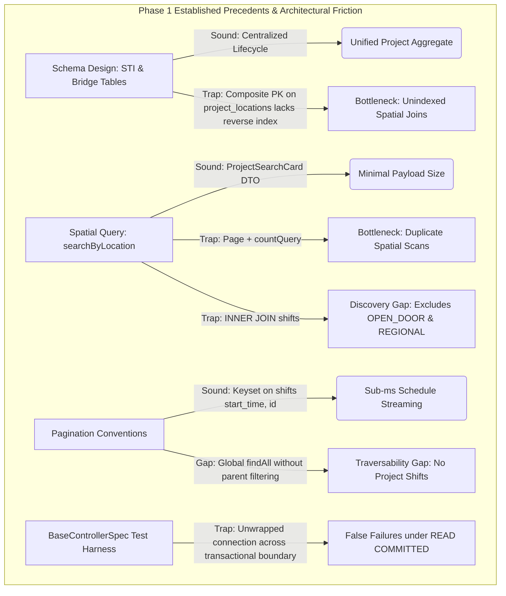
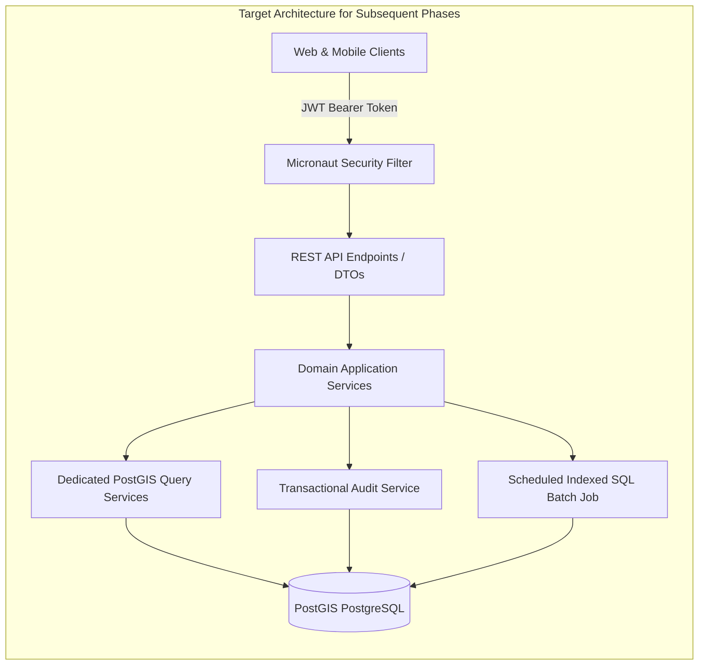
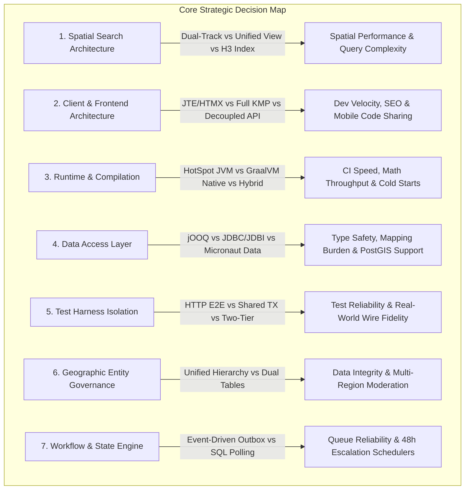

# Architectural & Technical Critique: Kaiju (Volunteer Monster)

**Date**: September 2, 2026
**Target Platform**: Kaiju (Backend Service for Volunteer Monster)
**Stack**: Micronaut 5, Java 25, PostgreSQL + PostGIS, Flyway, JTS, Spock, Testcontainers
**Project Phase**: Phase 1 (Data Foundation & Core Data — Work-In-Progress)
**Primary Goal**: Establish an agile, high-performance spatial data foundation for volunteer discovery, regional moderation tooling, and multiplatform clients.

---

## Executive Summary: A Precedence-Focused WIP Critique

The documentation across [README#L1-L42](../README.md#L1-L41), [roadmap#L1-L25](../roadmap.md#L1-L25), [domain#L1-L34](domain.md#L1-L33), and [DB#L1-L115](../database/DB.md#L1-L115) defines an ambitious, GIS-first volunteer management platform.

In evaluating this codebase, it is critical to recognize that **Kaiju is currently an active Work-In-Progress (WIP) in Phase 1 (Data Foundation & Core Data)**. Major capabilities—including server-side JTE public layouts (Phase 2), shift capacity limits and volunteer sign-up rosters (Phase 3), Authentik JWT role-based access filters, and Compose Multiplatform client apps (Phase 4)—are intentionally scheduled for subsequent roadmap milestones.

Consequently, this critique does not treat the absence of unbuilt roadmap features as bugs. Instead, it evaluates **the architecture and the precedents established by the work that HAS been completed**. It identifies structural pitfalls, coupling traps, and scalability friction embedded in the schema, query patterns, DTO conventions, and test harness that risk compromising **end-user performance and platform traversability** as the documented architecture is built out.



### Key Precedence Takeaways

1. **The Spatial Modeling Precedence**: Fowler's Single Table Inheritance (STI) pattern in [01-schema#L105-L128](../database/init/01-schema.sql#L105-L128) establishes a clean aggregate lifecycle for opportunity records. However, early documentation claimed STI optimizes PostGIS index scans; in reality, spatial data is normalized into [01-schema#L79-L89](../database/init/01-schema.sql#L79-L89) (`locations.geom`) and [01-schema#L98-L103](../database/init/01-schema.sql#L98-L103) (`boundaries.geom`), meaning spatial searches rely entirely on bridge table joins.
2. **The Reverse Index Precedence Gap**: The bridge table [01-schema#L130-L135](../database/init/01-schema.sql#L130-L135) (`project_locations`) establishes a primary key of `(project_id, location_id)`. Joining from `locations` into `project_locations` cannot perform an index-only seek on `location_id`, setting an unindexed join precedent.
3. **The Spatial Query Precedence Couples Discovery to Shifts**: In [ProjectRepository#L45-L48](../src/main/java/lol/pbu/kaiju/repository/ProjectRepository.java#L45-L48), the spatial radius query enforces `INNER JOIN shifts s ... WHERE s.start_time >= NOW()`. This sets a precedent that accidentally hides walk-in (`OPEN_DOOR`) and boundary-based (`REGIONAL`) opportunities from discovery.
4. **Pagination Precedence is Sound on Feeds, Heavy on Search**: Keyset cursoring in [ShiftRepository#L23](../src/main/java/lol/pbu/kaiju/repository/ShiftRepository.java#L23) sets an efficient precedent for chronological timelines. However, returning a full `Page` with a heavy `countQuery` in [ProjectRepository#L52-L66](../src/main/java/lol/pbu/kaiju/repository/ProjectRepository.java#L52-L66) doubles spatial query latency per page turn.
5. **Runtime Architecture Reality**: The build targets `eclipse-temurin:25-jre` in [build.gradle.kts#L110-L112](../build.gradle.kts#L110-L112), establishing standard HotSpot OpenJDK execution. Rather than worrying about GraalVM native image restrictions, the architecture should leverage Java 25 Virtual Threads for its blocking JDBC controllers.

---

## Part I: Core Architectural Precedents & Modeling Pitfalls

### 1. Spatial Modeling & Bridge Table Precedents

In [Project_Discriminator#L1-L32](../database/Project_Discriminator.md#L1-L32), the architecture defends Single Table Inheritance (`STANDARD`, `OPEN_DOOR`, `REGIONAL`) on the `projects` table:
> *"If we split these variations into four separate tables, the search engine would have to perform massive, slow `UNION` operations every time a user searched for 'opportunities near me.' By keeping them in a single table, the PostGIS spatial index can scan the entire ecosystem in milliseconds."*

#### Precedence Evaluation

- **The Aggregate Precedence is Sound**: Keeping all opportunity types in [01-schema#L105-L128](../database/init/01-schema.sql#L105-L128) (`projects`) centralizes status lifecycles, organization ownership ([01-schema#L108](../database/init/01-schema.sql#L108)), moderation routing ([01-schema#L109](../database/init/01-schema.sql#L109)), and foreign-key integrity ([01-schema#L148](../database/init/01-schema.sql#L148)). This eliminates multi-table unions for admin queues and organizer profile views.
- **The Spatial Premise Was Inaccurate**: The `projects` table has no geometry column. Spatial data is normalized into [01-schema#L79-L89](../database/init/01-schema.sql#L79-L89) (`locations.geom`) and [01-schema#L98-L103](../database/init/01-schema.sql#L98-L103) (`boundaries.geom`). Points and polygons use fundamentally different GiST index types (Point GiST vs Polygon GiST) and cannot be scanned together in a single index pass.
- **The Bridge Table Index Gap**: The join table [01-schema#L130-L135](../database/init/01-schema.sql#L130-L135) (`project_locations`) defines its composite primary key as `PRIMARY KEY (project_id, location_id)`. In PostgreSQL B-Trees, this only accelerates queries filtering by `project_id`. When the spatial query joins `locations l INNER JOIN project_locations pl ON l.id = pl.location_id`, PostgreSQL cannot perform an index-only lookup on `pl.location_id`.
- **Actionable Precedence Fix**: Add a reverse B-Tree index to join tables:

  ```sql
  CREATE INDEX idx_project_locations_location_id ON project_locations (location_id);

  ```

### 2. Pagination Precedents: Keyset Feeds vs. Dynamic Spatial Distance

In [DB#L60-L64](../database/DB.md#L60-L64), the architecture mandates keyset pagination:
> *"Pagination: Indexed on start_time and id to enforce high-performance cursored (keyset) pagination. Bypasses `OFFSET` completely."*

#### Precedence Evaluation

- **Keyset Precedence on Schedules is Outstanding**: For static chronological feeds, keyset pagination backed by `(start_time, id)` in [01-schema#L191](../database/init/01-schema.sql#L191) and [ShiftRepository#L23](../src/main/java/lol/pbu/kaiju/repository/ShiftRepository.java#L23) completely bypasses `OFFSET` table scans, providing sub-millisecond timeline streaming.
- **Offset Precedence on Local Spatial Radii is Pragmatic**: Distance from an arbitrary user GPS coordinate cannot be indexed in a static B-Tree index. For localized radius searches ($N < 100$), standard offset/limit pagination is the industry-standard, performant pattern.
- **The `countQuery` Precedence Trap**: While offset pagination is appropriate for spatial search, returning a full `Page<ProjectSearchCard>` in [ProjectRepository#L52-L66](../src/main/java/lol/pbu/kaiju/repository/ProjectRepository.java#L52-L66) forces PostgreSQL to execute a duplicate 4-table spatial `countQuery` on every page turn.
- **Actionable Precedence Fix**: Switch spatial search to `Slice<ProjectSearchCard>` to eliminate the count query, halving database load during search navigation.

### 3. Frontend Strategy Precedents: Public JTE vs. Client Multiplatform

[architecture#L14-L18](architecture.md#L14-L18) prescribes two distinct frontend technologies:

1. **Public Web (Phase 2)**: Server-Side Rendered (SSR) HTML via JTE (Java Template Engine).
2. **Admin Dashboards & Mobile (Phase 4)**: Compose Multiplatform (Kotlin) targeting Web, Desktop, Android, and iOS.

#### Precedence Evaluation

- **Targeted Specialization**: JTE delivers sub-50ms TTFB, zero JavaScript bundle weight, and excellent SEO for public searchers on low-end mobile devices. Compose Multiplatform provides desktop-grade interactive tools (drag-and-drop shift builders, polygon map editors) and native mobile apps.
- **The Architectural Precedence Requirement**: Because JTE and Compose Multiplatform cannot share UI layouts or view logic, the backend must establish clean, contract-first **REST/JSON API endpoints**. Internal domain entities must not be tightly coupled to presentation layers.

### 4. Module Structure Precedents: The Single-Module Trade-Off

Commit `e39afc1` (*"Migrate to single module (#3)"*) consolidated the codebase into a single Java 25 module.

#### Precedence Evaluation

- **Velocity vs. Sharing**: Consolidating to a single module eliminated Gradle submodule friction and circular dependencies during early schema iteration.
- **Future Constraint to Respect**: Kotlin Multiplatform (required for Compose mobile apps in Phase 4) cannot compile Java 25 bytecode or records to Kotlin/Native (iOS). Developers must not attempt to share binary classes between the backend and mobile clients; the communication boundary must remain strictly decoupled over HTTP/JSON.

### 5. Runtime & Infrastructure Precedents: HotSpot JRE Deployment

Early architecture notes discussed GraalVM Native Image compilation ([build.gradle.kts#L65-L96](../build.gradle.kts#L65-L96), [architecture#L19-L26](architecture.md#L19-L26)).

#### Precedence Evaluation

- **Pragmatic HotSpot Reality**: The actual Docker build in [build.gradle.kts#L110-L112](../build.gradle.kts#L110-L112) specifies `baseImage = "eclipse-temurin:25-jre"`. This deploys on standard OpenJDK HotSpot JVM.
- **JIT Benefits for Spatial Math**: HotSpot's C2 JIT compiler optimizes JTS topological geometry routines ([build.gradle.kts#L32](../build.gradle.kts#L32)) over long-running service execution, while Generational ZGC delivers sub-millisecond pause times.
- **Concurrency Precedence Opportunity**: Controllers currently dispatch blocking JDBC queries via `@ExecuteOn(TaskExecutors.BLOCKING)` ([ProjectController#L24](../src/main/java/lol/pbu/kaiju/controller/ProjectController.java#L24)). Configuring Micronaut to use **Java 25 Virtual Threads** (`micronaut.executors.io.type: VIRTUAL`) will prevent thread starvation during concurrent search traffic.

### 6. Geographic Modeling Precedents: Dual Polygon Tables

[01-schema#L59-L103](../database/init/01-schema.sql#L59-L103) maintains two separate polygon tables:

1. `administrative_regions` ([01-schema#L59-L65](../database/init/01-schema.sql#L59-L65)): Hierarchical civic regions (`parent_region_id`) tied to moderation routing.
2. `boundaries` ([01-schema#L98-L103](../database/init/01-schema.sql#L98-L103)): Geographic operational footprints tied to `project_boundaries`.

#### Precedence Evaluation

- **Domain Separation vs Maintenance Friction**: Keeping human governance distinct from project operational perimeters is sound Domain-Driven Design. However, if a regional project geofences an existing county or municipality, staff must duplicate the polygon in both tables.
- **Precedence Opportunity**: Introduce a foreign key or spatial reference allowing `project_boundaries` to link directly to an existing `administrative_region_id` when an operational boundary coincides with a civic jurisdiction.

---

## Part II: Code Implementation & Quality Precedents

### 1. Security & RBAC Scaffolding Precedents

In Phase 1, endpoints are currently scaffolded open without security filters to facilitate database seeding ([08-global-locations](../database/init/08-global-locations.sql)) and rapid test iteration.

#### Precedence Warning for Phase 2/3

- The dependency `micronaut-security` is present in [build.gradle.kts#L19-L49](../build.gradle.kts#L19-L49).
- As Authentik JWT authentication and role-based access control are layered on:
  - Controller endpoints must be guarded with explicit `@Secured` annotations.
  - Role assignment in [UserController#L34-L37](../src/main/java/lol/pbu/kaiju/controller/UserController.java#L34-L37) must be restricted to global administrators to prevent privilege escalation.
  - Role definitions across database constraints ([01-schema#L7-L14](../database/init/01-schema.sql#L7-L14)) and Java enums ([UserRole#L5-L12](../src/main/java/lol/pbu/kaiju/model/UserRole.java#L5-L11)) must remain unified.

### 2. Audit Trail Precedents

Scaffolding generated [ProjectAuditLogController#L51-L98](../src/main/java/lol/pbu/kaiju/controller/ProjectAuditLogController.java#L51-L98) with mutable HTTP endpoints (`PUT /{id}`, `DELETE /{id}`).

#### Precedence Warning

- Audit logs must be an immutable, append-only record bound to business transactions or database triggers. Exposing HTTP mutation endpoints—even during prototyping—creates an anti-pattern that must be removed before production deployment.

### 3. Spatial Search Discovery Precedents

In [ProjectRepository#L28-L51](../src/main/java/lol/pbu/kaiju/repository/ProjectRepository.java#L28-L51):

```sql
SELECT DISTINCT ON (p.id) ...
FROM locations l
INNER JOIN project_locations pl ON l.id = pl.location_id
INNER JOIN projects p ON pl.project_id = p.id
INNER JOIN shifts s ON (s.project_id = p.id AND s.location_id = l.id)
WHERE p.status = 'ACTIVE'
  AND s.start_time >= NOW()
  AND ST_DWithin(l.geom, CAST(:point AS geography), :radiusMeters)

```

#### Precedence Flaws

1. **Drops `OPEN_DOOR` Projects**: Walk-in drop-off opportunities do not have shifts. The `INNER JOIN shifts s` excludes them from spatial discovery.
2. **Drops `REGIONAL` Projects**: Regional opportunities associate with boundary polygons, not point locations.
3. **Sort Non-Determinism**: The outer query (`ORDER BY ST_Distance(...) ASC`) lacks a secondary tie-breaker, causing page jitter across pagination requests.
4. **Actionable Precedence Fix**: Change the join to `LEFT JOIN shifts s ON (s.project_id = p.id AND s.location_id = l.id AND s.start_time >= NOW())` and append `project_.id ASC` as a deterministic tie-breaker.

### 4. API Serialization & DTO Precedents

- **The Good Precedence**: [ProjectSearchCard#L8-L16](../src/main/java/lol/pbu/kaiju/model/ProjectSearchCard.java#L8-L16) is a clean, immutable, `@Serdeable` DTO that transmits only required fields over the wire.
- **The Precedence Risk in CRUD**: CRUD controllers ([ProjectController#L39-L47](../src/main/java/lol/pbu/kaiju/controller/ProjectController.java#L39-L47), [LocationController#L33-L41](../src/main/java/lol/pbu/kaiju/controller/LocationController.java#L33-L41)) return raw database entities. [JtsPointConverter#L14-L58](../src/main/java/lol/pbu/kaiju/model/JtsPointConverter.java#L14-L58) is a JDBC converter, not a Jackson serializer; JTS `Point` and `Polygon` types do not serialize over HTTP without custom serializers. Public endpoints should standardize on DTO projections.
- **The `/no-look` Endpoints**: Sister endpoints like [ProjectController#L75-L78](../src/main/java/lol/pbu/kaiju/controller/ProjectController.java#L75-L78) (`updateProjectNoLook`) skip `existsById` checks. While effective for bulk ingestion throughput, they should be segregated to internal administrative sync paths rather than public REST APIs.

---

## Part III: Test Suite Architecture Precedents

### 1. Test Isolation in BaseControllerSpec

Integration specifications currently encounter assertion failures across `AdministrativeRegionControllerSpec`, `BoundaryControllerSpec`, `LocationControllerSpec`, and `OrganizationControllerSpec`.

```groovy
// BaseControllerSpec.groovy:L10-L23
@MicronautTest(transactional = true)
class BaseControllerSpec extends Specification {
    @Inject @Shared DataSource dataSource
    @Shared Sql sql

    def setupSpec() {
        def target = dataSource.hasProperty('targetDataSource') ? dataSource.targetDataSource : dataSource
        sql = new Sql((DataSource) target)
    }
}

```

#### Why the Precedence Fails

1. `@MicronautTest(transactional = true)` starts a transaction before each test method on connection $A$.
2. The controller executes an insert on connection $A$.
3. The test asserts database state using `sql.firstRow(...)` on connection $B$ (the unwrapped target data source).
4. Under PostgreSQL default `READ COMMITTED` isolation, connection $B$ **cannot view uncommitted changes from connection $A$**, triggering false `SpockAssertionError`s.
5. **Actionable Precedence Fix**: Configure `@MicronautTest(transactional = false)` with fast table cleanup between specs, or bind `groovy.sql.Sql` directly to the active transaction context.

### 2. Expanding to HTTP Wire Verification

Tests currently inject controller beans directly (`@Inject LocationController locationController`) and execute in-process Java method calls. While fast for parameter validation testing, it leaves HTTP routing, query parameter coercion, and JSON Serde serialization unvalidated. Adding targeted `HttpClient` wire tests will establish full integration confidence.

---

## Part IV: Operational & Configuration Precedents

1. **Database Configuration Alignment**:
   - Align credentials between [compose.yml#L6-L8](../database/compose.yml#L6-L8) (standalone development) and [application.yml#L7-L10](../src/main/resources/application.yml#L7-L10) (default configuration).
2. **Flyway Migration Packaging**:
   - In [application.yml#L19-L22](../src/main/resources/application.yml#L19-L22), replace `filesystem:database/init` with standard classpath migration (`classpath:db/migration`) so migrations execute reliably inside packaged container images.
3. **Secret Hygiene**:
   - Ensure local environment secrets in `.env` are properly excluded from version control via [.gitignore#L1-L27](../.gitignore#L1-L27).

---

## Part V: Strategic Architecture Blueprint



### Key Tactical Recommendations for Subsequent Phases

1. **Refine the Spatial Query Precedence (Immediate)**:
   - Update [ProjectRepository#L45](../src/main/java/lol/pbu/kaiju/repository/ProjectRepository.java#L45) to `LEFT JOIN shifts` so drop-in opportunities appear in local searches.
   - Switch [ProjectRepository#L62](../src/main/java/lol/pbu/kaiju/repository/ProjectRepository.java#L62) from `Page<ProjectSearchCard>` to `Slice<ProjectSearchCard>` and remove `countQuery`.
   - Add a reverse index on `project_locations (location_id)`.
2. **Establish Scoped Repository Precedents (Phase 1 Cleanup)**:
   - Add project-scoped queries to [ShiftRepository#L16-L30](../src/main/java/lol/pbu/kaiju/repository/ShiftRepository.java#L16-L30) (`findByProjectIdAndStartTimeGreaterThanEquals`) to enable parent-scoped keyset streaming.
3. **Fix Test Isolation Precedents (Immediate)**:
   - Correct connection binding in [BaseControllerSpec#L10-L23](../src/test/groovy/lol/pbu/kaiju/controller/BaseControllerSpec.groovy#L10-L23) by setting `transactional = false`.
4. **Prepare for Public Discovery Views (Phase 2)**:
   - Add JTE view support in [build.gradle.kts#L19-L49](../build.gradle.kts#L19-L49) for sub-50ms public web browsing.
   - Configure HTTP cache-control headers (`Cache-Control: public, max-age=60`) on search card responses.
5. **Enable Java 25 Virtual Threads (Phase 2)**:
   - Configure Micronaut's blocking I/O executor to use virtual threads, ensuring high concurrency under heavy spatial search traffic.

---

## Part VI: Strategic Architectural Trade-Offs & Decisions to Ponder

This section outlines the seven core architectural decisions for Kaiju as subsequent roadmap phases are implemented:



---

### Decision 1: Spatial Data Modeling & Search Architecture

#### Option A: Decoupled Dual-Track Spatial Query Service (Recommended)

- **Architecture**: A dedicated application service that executes two targeted PostGIS queries in parallel:
  1. Point proximity: `ST_DWithin` on `locations.geom` for physical locations.
  2. Polygon containment: `ST_Intersects` on `boundaries.geom` for regional opportunities.
- **Pros**: Utilizes PostGIS GiST indexes as engineered; prevents complex 4-table joins from accidentally dropping non-shift opportunities.
- **Cons**: Interleaving point distance with regional relevance requires service-layer coordination.

#### Option B: Unified PostGIS Materialized Spatial View

- **Architecture**: Project all searchable entities into a normalized spatial shape: `(entity_id, entity_type, geom, next_shift_start, status)`.
- **Pros**: Single query endpoint; pushes spatial ranking and pagination to PostgreSQL.
- **Cons**: Refresh latency; merging Points and Polygons into one column weakens constraints.

#### Option C: Discrete Global Grid Indexing (Uber H3 / S2)

- **Architecture**: Quantize points and polygons into hierarchical hexagonal cells (H3 resolution 7–9).
- **Pros**: Enormous throughput gains; simple $O(1)$ set lookups; trivial Redis caching.
- **Cons**: Ingestion conversion complexity; polygon boundary edge approximation.

---

### Decision 2: Frontend & Client Architecture Alignment

#### Option A: Modern Hypermedia Monolith (JTE + HTMX + Tailwind CSS)

- **Architecture**: Use JTE + HTMX for both public search and admin web dashboards. Expose REST APIs strictly for mobile.
- **Pros**: Maximum development velocity; zero multi-megabyte canvas downloads; excellent SEO.
- **Cons**: Does not share UI code with Phase 4 mobile apps (`androidApp` / `iosApp`).

#### Option B: Full-Stack Kotlin Multiplatform (KMP + Compose Multiplatform)

- **Architecture**: Shared KMP core with Compose Multiplatform across Web (Wasm), Android, iOS, and Desktop.
- **Pros**: Maximum UI layout and networking reuse across platforms.
- **Cons**: Compose Web (Wasm) has high initial bundle sizes, ill-suited for public web SEO.

#### Option C: Decoupled API-First Architecture (Recommended)

- **Architecture**: Micronaut backend acts strictly as a high-performance REST/JSON API. Public web uses server-rendered JTE (or Next.js/SvelteKit), while admin and mobile apps use Compose Multiplatform.
- **Pros**: Clean boundaries; specialized technologies for distinct audience requirements.
- **Cons**: Contract maintenance across API surfaces.

---

### Decision 3: Compilation, Runtime, & Infrastructure Strategy

#### Option A: Standard HotSpot OpenJDK with Java 25 (Recommended)

- **Architecture**: Deploy containerized OpenJDK HotSpot (`eclipse-temurin:25-jre`) with Generational ZGC.
- **Pros**: Fast developer build loop; standard profiling (JFR, AsyncProfiler); C2 JIT optimization for JTS geometry algorithms; native Virtual Thread support.
- **Cons**: Cold start of 1–3s (immaterial for long-running stateful services with connection pools).

#### Option B: GraalVM Native Image

- **Architecture**: Enforce native binary compilation across CI pipelines.
- **Pros**: Instant startup and smaller baseline memory footprint.
- **Cons**: 5–10 minute build times; strict reflection limitations; difficult debugging for spatial math libraries.

---

### Decision 4: Data Access Layer & PostGIS Query Engine

#### Option A: Retain Micronaut Data JDBC with Native `@Query` (Recommended for Phase 1/2)

- **Architecture**: Continue using Micronaut Data JDBC, leveraging native SQL for custom PostGIS queries while using repository conventions for CRUD.
- **Pros**: Zero reflection; compile-time query validation; instant startup; zero build-time code-generation overhead.
- **Cons**: Complex multi-table joins must be maintained in raw SQL strings.

#### Option B: jOOQ with PostGIS Spatial Extensions

- **Architecture**: Generate type-safe Java DSL classes directly from PostgreSQL schema.
- **Pros**: Compile-time type safety for spatial operators; first-class keyset pagination support.
- **Cons**: Requires live database connectivity during Gradle builds; schema migration friction during early development.

---

### Decision 5: Test Suite Strategy & Database Isolation

#### Option A: HTTP-First Test Harness with Testcontainers (Recommended)

- **Architecture**: Run tests as true black-box HTTP integration tests using Micronaut's `HttpClient`. Disable automatic transactional rollbacks (`@MicronautTest(transactional = false)`) and clean fixtures explicitly:

  ```groovy
  @MicronautTest(transactional = false)
  class ProjectControllerSpec extends Specification {
      @Inject @Client("/") HttpClient client
  }

  ```

- **Pros**: Validates the entire stack (Netty routing, JSON Serde, PostGIS constraints); eliminates transactional connection mismatches.
- **Cons**: Slightly longer execution than in-memory rollbacks.

#### Option B: Shared-Connection Transactional Harness

- **Architecture**: Retain `@MicronautTest(transactional = true)`, but bind `groovy.sql.Sql` to the active transaction connection.
- **Pros**: Fast zero-cleanup rollbacks; fixes current assertion failures immediately.
- **Cons**: Tests only in-process Java method calls; bypasses HTTP wire serialization.

---

### Decision 6: Geographic Entity Governance (Boundaries vs. Regions)

#### Option A: Distinct Bounded Contexts with Reference Linking (Recommended)

- **Architecture**: Maintain `administrative_regions` for human governance and `boundaries` for project operational areas. Add an optional `administrative_region_id` to `boundaries` so custom boundaries can reuse existing civic polygons.
- **Pros**: Preserves DDD separation while eliminating duplicate polygon storage when operational areas match civic jurisdictions.
- **Cons**: Requires a minor foreign-key migration on `boundaries`.

#### Option B: Unified Hierarchical Geography Table

- **Architecture**: Consolidate `boundaries` and `administrative_regions` into a single `geographic_regions` table with a `region_type` discriminator.
- **Pros**: Single spatial table for both geofencing and moderation routing.
- **Cons**: Mixes human authority hierarchies with arbitrary environmental shapes (watersheds, wildfire zones).

---

### Decision 7: Workflow & Moderation State Engine

#### Option A: In-Database State Machine with Scheduled SQL Jobs (Recommended for Phase 1/2)

- **Architecture**: Manage status transitions within domain services. Use scheduled background jobs (`@Scheduled`) backed by a partial index to escalate pending projects after 48 hours:

  ```sql
  CREATE INDEX idx_projects_pending_escalation ON projects (managing_region_id, created_at)
  WHERE status = 'PENDING';

  ```

- **Pros**: Zero external infrastructure; executes in under 2 milliseconds on PostgreSQL.
- **Cons**: Table contention under extreme queue volumes; lacks distributed tracing.

#### Option B: Event-Driven Workflow with Transactional Outbox

- **Architecture**: Emit domain events to an `outbox` table and process timers via an asynchronous worker or orchestrator (e.g. Temporal).
- **Pros**: Resilient state transitions; native integration for external notifications (email/SMS).
- **Cons**: Additional infrastructure complexity premature for early-stage development.
