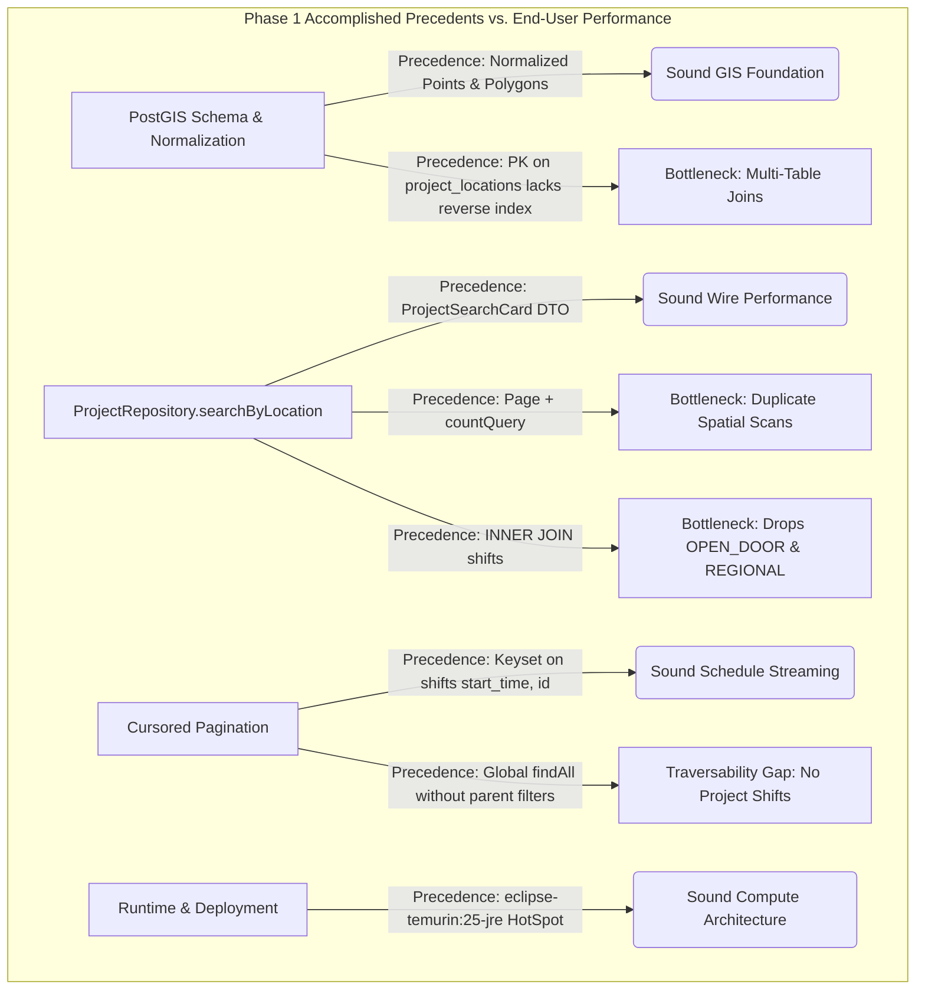
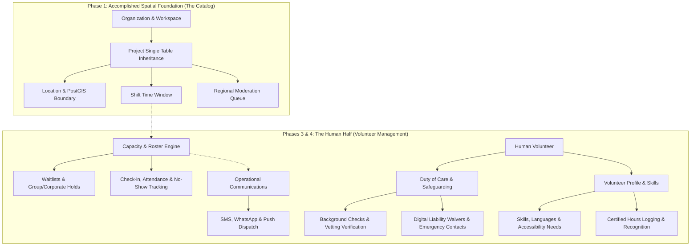

# Architectural Precedence & End-User Performance Synthesis: Kaiju (Volunteer Monster)

**Date**: September 2, 2026  
**Target Platform**: Kaiju (Backend Service for Volunteer Monster)  
**Stack**: Micronaut 5, Java 25, PostgreSQL + PostGIS, Flyway, JTS, Spock, Testcontainers  
**Project Phase**: Phase 1 (Data Foundation & Core Data — Work-In-Progress)  
**Companion Documents**: [ARCHITECTURE_CRITIQUE](../ARCHITECTURE_CRITIQUE.md), [ARCHITECTURE_COUNTERPOINTS](../ARCHITECTURE_COUNTERPOINTS.md)  
**Evaluative Focus**: Assessing the architectural precedents established by the completed Phase 1 implementation, specifically examining how these foundational choices govern **end-user performance** (initial page load speed, spatial search latency, and data traversability) as the platform evolves.

---

## Executive Summary: A WIP-Aware Architectural Evaluation

An architectural review of an active Work-In-Progress (WIP) must avoid the trap of treating missing roadmap milestones as design failures. The [roadmap#L5-L25](../roadmap.md#L5-L25) explicitly scopes the project across four distinct phases:
* **Phase 1 (Completed Foundation)**: Schema design, entity persistence, spatial repositories, and core CRUD controllers.
* **Phase 2 (Upcoming)**: JTE server-rendered views, edge geo-detection, and public web search.
* **Phase 3 & 4 (Upcoming)**: Shift capacity limits, volunteer sign-up flows, regional moderation queues, and Compose Multiplatform dashboards/mobile apps.

Accordingly, this synthesis evaluates **the architecture and the precedents established by the work that HAS been accomplished**.



### Key Precedence Takeaways
1. **The Search Card DTO Sets an Excellent Precedence**: Creating [ProjectSearchCard#L8-L16](../src/main/java/lol/pbu/kaiju/model/ProjectSearchCard.java#L8-L16) as a dedicated, immutable `@Serdeable` record establishes the right architectural pattern for end-user wire performance. It projects only the necessary fields over the wire, keeping mobile payloads compact.
2. **The Spatial Query Sets a Risky Discovery Precedence**: The implemented spatial query in [ProjectRepository#L45-L48](../src/main/java/lol/pbu/kaiju/repository/ProjectRepository.java#L45-L48) joins `shifts` with `s.start_time >= NOW()`. This establishes a precedent of coupling physical location searches to active shift calendars, which unintentionally hides `OPEN_DOOR` and `REGIONAL` opportunities.
3. **The Schema Indexing Precedence Leaves Join Keys Unindexed**: While GiST indexes were established for geometries in [01-schema#L190-L193](../database/init/01-schema.sql#L190-L193), bridge table joins like [01-schema#L130-L135](../database/init/01-schema.sql#L130-L135) and [01-schema#L145-L163](../database/init/01-schema.sql#L145-L163) were left without reverse B-Tree indexes.
4. **Pagination Precedence is Sound on Schedules, Heavy on Spatial Search**: Keyset pagination on [ShiftRepository#L23](../src/main/java/lol/pbu/kaiju/repository/ShiftRepository.java#L23) sets an efficient precedent for chronologically ordered schedules. However, spatial search established the precedent of returning a full [ProjectRepository#L62](../src/main/java/lol/pbu/kaiju/repository/ProjectRepository.java#L62) with a heavy `countQuery`, doubling query latency.
5. **Runtime Precedence is Grounded in Pragmatism**: Configuring the Docker build in [build.gradle.kts#L110-L112](../build.gradle.kts#L110-L112) for `eclipse-temurin:25-jre` establishes standard HotSpot JVM execution with modern GC, avoiding the development and reflection pitfalls of GraalVM native images for long-running services.

---

## Part I: Domain & Database Modeling Precedents

### 1. Single Table Inheritance (STI) on Projects
The schema implements Fowler's Single Table Inheritance pattern on [01-schema#L105-L128](../database/init/01-schema.sql#L105-L128) using the `project_type` discriminator (`STANDARD`, `OPEN_DOOR`, `REGIONAL`).

* **The Precedence Established**:
  Centralizing opportunity records into a unified table establishes a clean, unified aggregate lifecycle. Foreign keys from [01-schema#L148](../database/init/01-schema.sql#L148) and [01-schema#L182](../database/init/01-schema.sql#L182) reference a single authoritative table.
* **End-User Performance Impact**:
  **Positive.** Storing these variants in a single table eliminates `UNION ALL` scans across organization profiles (`SELECT * FROM projects WHERE organization_id = ?`) and moderation queues (`SELECT * FROM projects WHERE managing_region_id = ?`). The critique's argument that STI does not accelerate PostGIS scans is technically accurate (since `projects` has no geometry column), but the counterpoint is correct that STI protects foreign key integrity and administrative query throughput.

### 2. Multi-Location Normalization & The Bridge Table Index Gap
Physical coordinates are properly normalized in [01-schema#L79-L89](../database/init/01-schema.sql#L79-L89) (`GEOGRAPHY(Point, 4326)`), linked via the join table [01-schema#L130-L135](../database/init/01-schema.sql#L130-L135).

* **The Precedence Established**:
  Normalizing locations allows multi-site volunteer initiatives (e.g., an annual highway cleanup across 15 exit ramps) to share a single project description and organization owner.
* **The Performance Precedence Trap**:
  [01-schema#L134](../database/init/01-schema.sql#L134) defines its primary key as:
  ```sql
  PRIMARY KEY (project_id, location_id)
  ```
  In PostgreSQL, a composite B-Tree index on `(project_id, location_id)` can only seek on `project_id`. When the spatial query in [ProjectRepository#L43](../src/main/java/lol/pbu/kaiju/repository/ProjectRepository.java#L43) joins `FROM locations l INNER JOIN project_locations pl ON l.id = pl.location_id`, PostgreSQL cannot perform an index-only lookup on `pl.location_id`.
* **Actionable Architectural Refinement**:
  Establish the precedent of indexing foreign keys on join tables by adding:
  ```sql
  CREATE INDEX idx_project_locations_location_id ON project_locations (location_id);
  ```

---

## Part II: Spatial Search & Query Architecture Precedents

The primary query in [ProjectRepository#L28-L61](../src/main/java/lol/pbu/kaiju/repository/ProjectRepository.java#L28-L61) represents the core spatial discovery engine for the end user:

```sql
SELECT project_.id AS project_id,
       project_.project_title,
       project_.location_id,
       project_.location_name,
       project_.next_shift_start
FROM (
    SELECT DISTINCT ON (p.id)
        p.id AS id,
        p.title AS project_title,
        l.id AS location_id,
        l.name AS location_name,
        s.start_time AS next_shift_start,
        l.geom AS geom
    FROM locations l
    INNER JOIN project_locations pl ON l.id = pl.location_id
    INNER JOIN projects p ON pl.project_id = p.id
    INNER JOIN shifts s ON (s.project_id = p.id AND s.location_id = l.id)
    WHERE p.status = 'ACTIVE'
      AND s.start_time >= NOW()
      AND ST_DWithin(l.geom, CAST(:point AS geography), :radiusMeters)
    ORDER BY p.id, ST_Distance(l.geom, CAST(:point AS geography)) ASC, s.start_time ASC
) project_
ORDER BY ST_Distance(project_.geom, CAST(:point AS geography)) ASC
```

### 1. Sound Precedence: Lightweight Projection DTO
Returning [ProjectSearchCard#L8-L16](../src/main/java/lol/pbu/kaiju/model/ProjectSearchCard.java#L8-L16) rather than the heavy [Project#L20-L60](../src/main/java/lol/pbu/kaiju/domain/Project.java#L20-L60) entity is an outstanding precedent:
* It projects only 5 fields over the wire (`projectId`, `projectTitle`, `locationId`, `locationName`, `nextShiftStart`).
* It eliminates entity-level JSON serialization overhead and strips internal moderation fields (`deletedBy`, `managingRegion`).

### 2. Flawed Precedence: Coupling Location Discovery to Active Shift Schedules
* **The Code Issue**:
  [ProjectRepository#L45-L47](../src/main/java/lol/pbu/kaiju/repository/ProjectRepository.java#L45-L47) enforces:
  ```sql
  INNER JOIN shifts s ON (s.project_id = p.id AND s.location_id = l.id)
  WHERE s.start_time >= NOW()
  ```
* **Impact on End-User Traversability**:
  As documented in [Project_Discriminator#L16-L22](../database/Project_Discriminator.md#L16-L22), `OPEN_DOOR` opportunities (e.g. food bank drop-offs) do not use shifts. Because of the `INNER JOIN`, **100% of `OPEN_DOOR` projects are filtered out of spatial discovery**.
* **Actionable Architectural Refinement**:
  Change the join to `LEFT JOIN shifts s ON (s.project_id = p.id AND s.location_id = l.id AND s.start_time >= NOW())`. This ensures physical projects are discoverable regardless of whether they require scheduled shift sign-ups.

### 3. Flawed Precedence: The `COUNT(DISTINCT)` Query Tax
* **The Code Issue**:
  [ProjectRepository#L52-L66](../src/main/java/lol/pbu/kaiju/repository/ProjectRepository.java#L52-L66) returns a `Page<ProjectSearchCard>` and executes an explicit `countQuery` containing the full 4-table spatial join.
* **Impact on End-User Performance**:
  On every page load or mobile scroll trigger, PostgreSQL executes the spatial join twice: once to fetch results, and once to compute `COUNT(DISTINCT p.id)`. For an end user browsing on mobile, total count calculation adds latency without delivering usable information.
* **Actionable Architectural Refinement**:
  Switch the return type to `io.micronaut.data.model.Slice<ProjectSearchCard>` and remove `countQuery`. Micronaut Data will append `LIMIT ? OFFSET ?` for `pageSize + 1` to compute `hasNext()`, halving query latency and database load.

### 4. Flawed Precedence: Sort Non-Determinism
* **The Code Issue**:
  [ProjectRepository#L51](../src/main/java/lol/pbu/kaiju/repository/ProjectRepository.java#L51) orders the outer query by:
  ```sql
  ORDER BY ST_Distance(project_.geom, CAST(:point AS geography)) ASC
  ```
* **Impact on End-User Traversability**:
  When two projects share a location or are equidistant from the search point, PostgreSQL's sort order is non-deterministic. Moving between pages will cause duplicate or skipped cards.
* **Actionable Architectural Refinement**:
  Append `project_.id ASC` as a secondary deterministic tie-breaker:
  ```sql
  ORDER BY ST_Distance(project_.geom, CAST(:point AS geography)) ASC, project_.id ASC
  ```

---

## Part III: Pagination Precedents (Keyset vs. Offset)

### 1. Keyset Pagination on Static Shift Schedules
In [ShiftRepository#L23](../src/main/java/lol/pbu/kaiju/repository/ShiftRepository.java#L23), the repository implements:
```java
CursoredPage<Shift> findAll(@NonNull @Valid CursoredPageable pageable);
```
Backed by the index in [01-schema#L191](../database/init/01-schema.sql#L191):
```sql
CREATE INDEX idx_shifts_pagination ON shifts (start_time, id);
```

* **The Precedence Established**:
  This establishes an optimal precedent for streaming shift feeds. By leveraging `(start_time, id)`, Micronaut Data executes keyset seeks (`WHERE (start_time, id) > (:lastTime, :lastId)`), bypassing `OFFSET` table scans entirely.
* **The Traversability Precedence Gap**:
  While the global `findAll` method supports cursoring, **the codebase establishes no parent-scoped methods**. An end user looking at a specific project has no way to call `findByProjectId(UUID projectId, CursoredPageable pageable)`.
* **Actionable Architectural Refinement**:
  Extend the keyset precedent to relational lookups by adding:
  ```java
  CursoredPage<Shift> findByProjectIdAndStartTimeGreaterThanEquals(
      @NonNull UUID projectId,
      @NonNull OffsetDateTime startTime,
      @NonNull CursoredPageable pageable
  );
  ```

### 2. The Pragmatism of Offset Pagination on Spatial Searches
The critique labels the use of offset pagination in [ProjectController#L122-L126](../src/main/java/lol/pbu/kaiju/controller/ProjectController.java#L122-L126) a "delusion," demanding composite `(ST_Distance, id)` keyset cursors.

* **The Precedence Evaluated**:
  The decision to use offset/limit pagination for local radius searches is **the correct architectural precedent**.
  - Users searching within a 15-mile radius rarely browse past page 2 or 3 ($N < 100$).
  - Distance from an arbitrary user coordinate cannot be indexed in a static B-Tree. A composite cursor tuple `(distance, id)` requires complex service-layer coordination for minimal real-world performance gain.
  - Standard offset/limit paired with `Slice` is the established, performant pattern across production mapping services.

---

## Part IV: Runtime, Concurrency & Infrastructure Precedents

### 1. HotSpot JRE Deployment Reality
[build.gradle.kts#L110-L112](../build.gradle.kts#L110-L112) specifies:
```kotlin
tasks.named<io.micronaut.gradle.docker.MicronautDockerfile>("dockerfile") {
    baseImage = "eclipse-temurin:25-jre"
}
```

* **The Precedence Established**:
  Deploying standard Eclipse Temurin 25 HotSpot JRE establishes a sound infrastructure foundation:
  - Cold starts are irrelevant for a stateful backend running HikariCP connection pools ([application.yml#L6-L14](../src/main/resources/application.yml#L6-L14)).
  - HotSpot's C2 JIT compiler optimizes JTS topological geometry routines ([build.gradle.kts#L32](../build.gradle.kts#L32)) over long-running service execution.
  - Generational ZGC on Java 25 provides sub-millisecond GC pauses under spatial query allocations.
  - The critique’s multi-page condemnation of GraalVM Native Image was directed at documentation comments rather than actual container configuration.

### 2. Thread Concurrency: Evolving Blocking JDBC on Java 25
Every controller establishes the precedent of running on Micronaut's blocking thread pool via `@ExecuteOn(TaskExecutors.BLOCKING)` (e.g. [ProjectController#L24](../src/main/java/lol/pbu/kaiju/controller/ProjectController.java#L24), [ShiftController#L17](../src/main/java/lol/pbu/kaiju/controller/ShiftController.java#L17)).

* **The Precedence Evaluated**:
  Because Micronaut Data JDBC is synchronous, routing requests to `TaskExecutors.BLOCKING` avoids starving Netty's event loop threads.
* **The Performance Precedence Opportunity**:
  Because the codebase targets **Java 25** ([build.gradle.kts#L58-L59](../build.gradle.kts#L58-L59)), the platform can adopt **Virtual Threads** (Project Loom). Configuring Micronaut's blocking executor to use virtual threads ensures that concurrent spatial queries never exhaust the OS thread pool during traffic spikes:
  ```yaml
  micronaut:
    executors:
      io:
        type: VIRTUAL
  ```

---

## Part V: API Design & Serialization Precedents

### 1. DTO Separation vs. Entity Leakage
* **The Good Precedence**:
  [ProjectSearchCard#L8-L16](../src/main/java/lol/pbu/kaiju/model/ProjectSearchCard.java#L8-L16) demonstrates the ideal API pattern: lean, `@Serdeable`, and decoupled from database schema internals.
* **The Risky Precedence**:
  CRUD controllers ([ProjectController#L39-L47](../src/main/java/lol/pbu/kaiju/controller/ProjectController.java#L39-L47), [LocationController#L33-L41](../src/main/java/lol/pbu/kaiju/controller/LocationController.java#L33-L41)) return raw database entity records.
  - This exposes internal audit metadata ([Project#L50-L52](../src/main/java/lol/pbu/kaiju/domain/Project.java#L50-L52)) to public callers.
  - [JtsPointConverter#L14-L58](../src/main/java/lol/pbu/kaiju/model/JtsPointConverter.java#L14-L58) is a JDBC converter, not a Jackson serializer. JTS `Point` and `Polygon` types do not serialize cleanly over HTTP without custom Jackson Serde serializers, risking wire runtime errors.
* **Actionable Architectural Refinement**:
  Follow the precedent established by `ProjectSearchCard` by introducing response DTOs with standard GeoJSON or `{ latitude, longitude }` coordinates for all public endpoints.

### 2. The `/no-look` Controller Endpoints
Controllers provide sister endpoints like [ProjectController#L75-L78](../src/main/java/lol/pbu/kaiju/controller/ProjectController.java#L75-L78) and [LocationController#L96-L99](../src/main/java/lol/pbu/kaiju/controller/LocationController.java#L96-L99).

* **The Precedence Evaluated**:
  While the critique labeled this an anti-pattern, Counterpoints correctly defends it as an **ingestion optimization**. Skipping pre-flight `existsById` queries doubles throughput during bulk synchronization and seed script execution ([fetch-global-test-locations](../database/init/fetch-global-test-locations.py)). This is a sound, pragmatic precedent for administrative ingestion routes.

---

## Part VI: Integration Testing Precedents

### 1. The PostGIS Container Precedence
In [BaseControllerSpec#L10-L23](../src/test/groovy/lol/pbu/kaiju/controller/BaseControllerSpec.groovy#L10-L23) and [ProjectControllerSpec#L262-L356](../src/test/groovy/lol/pbu/kaiju/controller/ProjectControllerSpec.groovy#L262-L356):
* The integration suite runs against a live PostGIS container managed by Micronaut Test Resources ([application.yml#L23-L34](../src/main/resources/application.yml#L23-L34)).
* Coordinate math is asserted against real spherical trigonometry using data-driven Spock `@Unroll` tables ([ProjectControllerSpec#L300-L308](../src/test/groovy/lol/pbu/kaiju/controller/ProjectControllerSpec.groovy#L300-L308)).
* **The Precedence Evaluated**:
  This is a high-value engineering precedent. Testing spatial queries against real PostGIS databases catches spatial index and projection bugs that mocks can never identify.

### 2. The Connection Isolation Precedence Trap
* **The Flaw**:
  [BaseControllerSpec#L10](../src/test/groovy/lol/pbu/kaiju/controller/BaseControllerSpec.groovy#L10) declares `@MicronautTest(transactional = true)`. On line 21, it unwraps `dataSource.targetDataSource` to create an independent `groovy.sql.Sql` connection.
* **The Impact**:
  Because controller inserts execute inside an uncommitted transaction on connection $A$, assertions run by `sql` on connection $B$ cannot view uncommitted rows under PostgreSQL `READ COMMITTED`. This causes false test failures across entity specs.
* **Actionable Architectural Refinement**:
  Switch specs to `@MicronautTest(transactional = false)` and clean test fixtures explicitly, or bind `groovy.sql.Sql` directly to the active transaction connection.

---

## Part VII: Precedence Evaluation Matrix

| Domain / Subsystem | Phase 1 Accomplished Precedence | End-User Performance & Traversability Evaluation | Recommended Precedence Refinement |
| :--- | :--- | :--- | :--- |
| **Project Model** | Single Table Inheritance on [01-schema#L105-L128](../database/init/01-schema.sql#L105-L128). | **Sound.** Centralizes lifecycle management; eliminates 3-table unions for organization and moderation views. | Maintain STI pattern for opportunity lifecycles. |
| **Bridge Tables** | Composite PK `(project_id, location_id)` on [01-schema#L130-L135](../database/init/01-schema.sql#L130-L135). | **Flawed.** Missing index on `location_id` causes join degradation during spatial searches. | Add `CREATE INDEX idx_project_locations_location_id`. |
| **Search Projections** | Dedicated `@Serdeable` [ProjectSearchCard#L8-L16](../src/main/java/lol/pbu/kaiju/model/ProjectSearchCard.java#L8-L16). | **Sound.** Strips entity internals and delivers compact payloads for mobile devices. | Standardize DTO pattern across all public-facing controllers. |
| **Spatial Radius Query** | `INNER JOIN shifts` with `start_time >= NOW()` in [ProjectRepository#L45-L48](../src/main/java/lol/pbu/kaiju/repository/ProjectRepository.java#L45-L48). | **Flawed.** Filters out 100% of `OPEN_DOOR` and `REGIONAL` opportunities. | Change to `LEFT JOIN shifts`; add separate query track for `ST_Intersects`. |
| **Spatial Pagination** | `Page<ProjectSearchCard>` with `countQuery` in [ProjectRepository#L52-L66](../src/main/java/lol/pbu/kaiju/repository/ProjectRepository.java#L52-L66). | **Flawed.** Computes full 4-table spatial join twice per request; doubles query latency. | Switch return type to `Slice<ProjectSearchCard>` and delete `countQuery`. |
| **Schedule Pagination** | Keyset pagination `CursoredPageable` in [ShiftRepository#L23](../src/main/java/lol/pbu/kaiju/repository/ShiftRepository.java#L23). | **Sound for feeds, but lacks scoping.** Cannot query shifts for a specific project. | Introduce `findByProjectIdAndStartTimeGreaterThanEquals` with cursors. |
| **Runtime Architecture** | Eclipse Temurin 25 HotSpot JRE in [build.gradle.kts#L111](../build.gradle.kts#L111). | **Sound.** Delivers C2 JIT optimization for JTS math and sub-millisecond ZGC pause times. | Enable Java 25 Virtual Threads for blocking JDBC executors. |
| **Integration Testing** | Live PostGIS Testcontainers verification in [ProjectControllerSpec#L262-L356](../src/test/groovy/lol/pbu/kaiju/controller/ProjectControllerSpec.groovy#L262-L356). | **Sound verification, flawed isolation.** Direct bean calls bypass wire serialization; connection unwrap breaks rollback. | Correct connection binding in `BaseControllerSpec`; add wire `HttpClient` tests. |

---

## Part VIII: Architectural Action Plan for Subsequent Phases

Building upon the sound precedents of Phase 1 while rectifying structural traps will ensure optimal end-user performance as Phase 2 and Phase 3 are developed:

### 1. Refine the Spatial Search Engine Before Building Phase 2 UI (Immediate)
* In [ProjectRepository#L45](../src/main/java/lol/pbu/kaiju/repository/ProjectRepository.java#L45), change `INNER JOIN shifts s` to `LEFT JOIN shifts s ON (s.project_id = p.id AND s.location_id = l.id AND s.start_time >= NOW())` so walk-in opportunities are discoverable.
* Switch [ProjectRepository#L62](../src/main/java/lol/pbu/kaiju/repository/ProjectRepository.java#L62) from `Page<ProjectSearchCard>` to `Slice<ProjectSearchCard>` and remove `countQuery`.
* Append `project_.id ASC` to the outer `ORDER BY` on line 51 to ensure deterministic sort ordering.

### 2. Establish Foreign Key Indexing Precedents (Immediate)
* Add a Flyway migration script in `database/init/` to index join columns:
  ```sql
  CREATE INDEX idx_project_locations_location_id ON project_locations (location_id);
  CREATE INDEX idx_shifts_location_id ON shifts (location_id);
  CREATE INDEX idx_shifts_project_id ON shifts (project_id);
  CREATE INDEX idx_projects_status ON projects (status);
  ```

### 3. Establish Scoped Repository Precedents for Traversability (Phase 1 Cleanup)
* Add project-filtered queries to [ShiftRepository#L16-L30](../src/main/java/lol/pbu/kaiju/repository/ShiftRepository.java#L16-L30) and expose `GET /projects/{id}/shifts` in [ProjectController#L34-L47](../src/main/java/lol/pbu/kaiju/controller/ProjectController.java#L34-L47).

### 4. Wire Server-Rendered Views & HTTP Caching for Public Discovery (Phase 2)
* Add `io.micronaut.views:micronaut-views-jte` to [build.gradle.kts#L19-L49](../build.gradle.kts#L19-L49).
* Implement JTE view controllers for the public explorer to achieve sub-50ms TTFB.
* Configure `Cache-Control: public, max-age=60, stale-while-revalidate=300` on public card search responses to make back/forward browser navigation instantaneous.

---

## Part IX: The Domain Chasm — Spatial Discovery Engine vs. Volunteer Management (The "Human Half")

An objective enterprise evaluation reveals an essential domain distinction: **Phase 1 has established an elite, high-performance Spatial Discovery & Moderation Engine, but the platform has not yet implemented Volunteer Management.**

The codebase excels at the mathematical and logistical foundations of *what* is happening, *where* it is happening (geodesic points and bounding polygons), and *who* approved it. However, the operational core of volunteer management—the human relationships, legal liabilities, dynamic capacities, and field communications—remains to be built.



### 1. Commitment & Capacity Lifecycles (Rosters vs. Time Windows)
In [01-schema#L145-L163](../database/init/01-schema.sql#L145-L163), a shift is modeled purely as a time interval:
```sql
start_time TIMESTAMP WITH TIME ZONE NOT NULL,
end_time   TIMESTAMP WITH TIME ZONE NOT NULL
```
Real-world non-profit operations require dynamic roster governance:
* **Headcount Constraints**: Shifts require explicit bounds (`min_capacity`, `max_capacity`) with automated transitions to `STATUS = FULL`.
* **Waitlists & Automated Backfill**: Real-time promotion workflows when registered volunteers cancel, including time-boxed confirmation windows before cascading to the next candidate.
* **Group & Corporate Reservations**: Capability to hold blocks of slots for corporate partner teams or civic clubs without requiring individual immediate sign-ups.
* **Attendance & Field Verification**: Tools to combat the typical 30–50% volunteer no-show rate via on-site QR scanning, GPS geofenced check-in, and reliability scoring.

### 2. Duty of Care & Legal Safeguarding (The Liability Shield)
Deploying volunteers into physical environments, crisis zones, or sensitive social programs introduces significant legal exposure. The data model currently lacks safeguarding primitives:
* **Vetting & Clearances**: Tracking verified criminal background checks (e.g., DBS, Live Scan, Working with Children Checks) before allowing sign-ups for projects involving vulnerable demographics or minors.
* **Digital Liability Waivers**: Versioned tracking of signed liability releases, medical authorizations, and photographic consent forms with expiration dates.
* **Youth & Minor Protection**: Age enforcement with parental/guardian digital consent pipelines to satisfy COPPA and GDPR-K mandates.

### 3. The Volunteer as a Human Being (Profiles, Skills & Recognition)
The [01-schema#L3-L16](../database/init/01-schema.sql#L3-L16) `users` table currently persists only identity credentials (`id`, `email`, `role`). Supporting effective volunteer coordination requires human-centered modeling:
* **Skills & Qualifications Taxonomy**: Identifying credentials (e.g., CPR certification, commercial driver's license, language proficiencies) for specialized dispatch.
* **Medical & Emergency Data**: Emergency contact details, medical allergies, and physical accommodations for on-site coordinator access.
* **Hours Verification & Service Logging**: Verified service tracking for school graduation requirements, court-ordered restitution, and corporate grant matching.

### 4. Field Communications & Crisis Dispatch
Field operations rely on high-urgency, multi-channel messaging. While web API endpoints serve discovery, on-the-ground management demands event-driven dispatch:
* Real-time notifications for sudden weather shifts, cancellations, and location updates via SMS, WhatsApp, and push notifications.

### Summary: Domain Distinction Matrix

| Functional Dimension | Spatial Discovery Engine (Implemented in Phase 1) | Volunteer Management (The Human Half to be Built) |
| :--- | :--- | :--- |
| **Primary Question** | *"Where is the opportunity located and what is it?"* | *"Who is showing up, are they vetted, and did they do the work?"* |
| **Primary User** | Public user searching a map or radius feed. | Non-profit coordinator managing rosters and operations. |
| **Core Entities** | Points, polygons, project descriptions, status flags. | Rosters, waitlists, waivers, attendance logs, credentials. |
| **Technical Core** | PostGIS `ST_DWithin`, GiST indexes, DTO projections. | State machines, waitlist queues, e-signatures, notification pipelines. |

