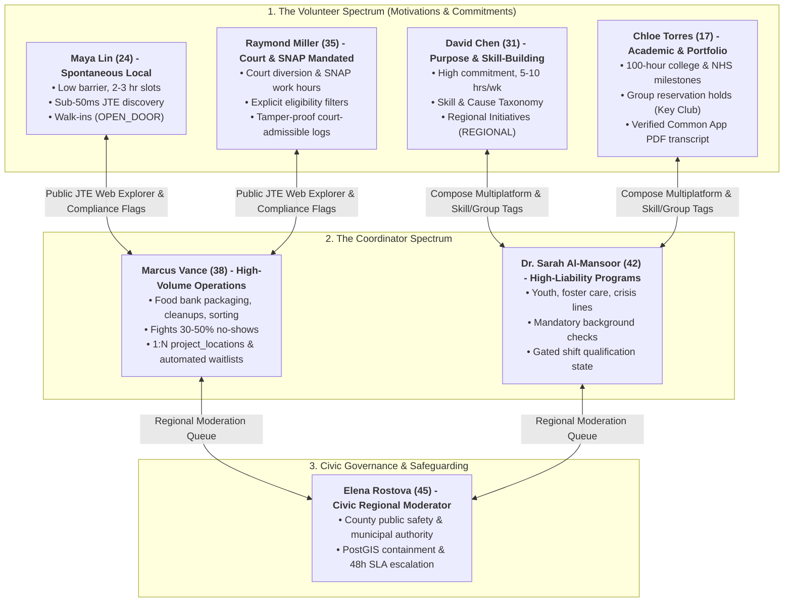

# Comprehensive Human Strategy & Empathy Maps: Kaiju (Volunteer Monster)

**Date**: September 2026  
**Target Platform**: Kaiju (Backend Service for Volunteer Monster)  
**Stack**: Micronaut 5, Java 25, PostgreSQL 17 + PostGIS, Flyway, JTE, Compose Multiplatform, Authentik  
**Companion Diagram**: [`docs/human-strategy-personas.drawio`](./human-strategy-personas.drawio)  
**Methodological Standard**: Nielsen Norman Group (NN/g) Proto-Personas & 4-Quadrant Empathy Mapping  

---

## Executive Summary: The Dual Human Spectrums & The Domain Chasm

As established in early architectural planning, the Kaiju platform has achieved an elite, high-performance foundation in **Phase 1: Spatial Discovery & Core Data**. Through PostgreSQL 17, PostGIS `GEOGRAPHY(Point, 4326)` and `Polygon` indexing, Fowler's Single Table Inheritance (STI), and Micronaut 5 compile-time dependency injection, the system excels at answering:
> *"Where is an initiative located, what type of opportunity is it, and within which civic boundary does it reside?"*

However, an enterprise volunteer management ecosystem encompasses **two distinct human spectrums**:

1. **The Volunteer Spectrum (Motivation & Barrier vs. Commitment)**:
   * **Spontaneous / Proximity-First Volunteers (Maya)**: Seeking low-friction, 2-to-3-hour opportunities near home. High abandonment risk if faced with login walls, paperwork, or mobile lag.
   * **Purpose-Driven & Skill-Building Volunteers (David)**: Seeking cause alignment (#wildlife, #climate) and professional skill utilization (#gis, #data-analysis). Willing to complete background checks, attend orientations, and commit to multi-month recurring schedules.
   * **Academic & Portfolio-Building Students (Chloe)**: Seeking 100+ verified service hours for college admissions, National Honor Society, or club philanthropy. Requires group slot reservations and official, accredited PDF transcripts.
   * **Compliance & Mandated Volunteers (Raymond)**: Fulfilling court-ordered community restitution or SNAP ABAWD monthly work requirements. Requires explicit court/SNAP eligibility filters, GPS-verified check-in/out timestamps, and tamper-proof legal reporting to avoid probation violations or benefit loss.

2. **The Non-Profit Coordinator Spectrum (Volume vs. Liability)**:
   * **High-Volume Operations Coordinators (Marcus)**: Managing food banks, community cleanups, and warehouse packaging lines. Battles a chronic 30–50% volunteer no-show rate and needs fast multi-site shift coordination.
   * **Specialized & High-Liability Program Directors (Dr. Sarah)**: Managing youth mentorship, foster care, and 24/7 crisis support lines. Legally cannot allow "just anyone off the street" near vulnerable populations. Requires mandatory background check vetting, certified training gates, and credential expiration tracking.

3. **The Civic Governance Authority**:
   * **Civic Regional Moderators (Elena)**: Municipal leaders responsible for public safety, territorial boundary integrity, and 48-hour SLA turnaround.

---

## 1. Maya Lin - The Spontaneous Local Volunteer

### Proto-Persona Profile

* **Archetype**: The Spontaneous Local Volunteer (`STANDARD_USER` / Public Searcher)
* **Demographics**: 24 years old, Marketing Specialist & Part-time Graduate Student. Urban apartment resident, public transit & bicycle commuter.
* **Context**: Maya wants to contribute to her local community and fulfill a 20-hour service requirement for her degree. Juggling corporate work and night classes, her availability is constrained to specific 2-to-3-hour weekend windows. She has zero patience for administrative paperwork, mandatory app downloads, or account creation walls just to view event details.
* **Tech Environment**: iPhone 15 on cellular data / transit Wi-Fi. High sensitivity to web page weight and battery drain.

| Quadrant | Observed & Internalized Insights |
| :--- | :--- |
| **SAYS** *(Verbal Quotes)* | |
| **THINKS** *(Internalized Beliefs)* | • *💭 "I hope this isn't disorganized like the last cleanup where we stood around for 45 minutes waiting for tools."* • *💭 "Is this neighborhood safe to bike to early on a Saturday morning? Where do I safely park?"* • *💭 "Will anyone actually notice or care if I show up, or am I just an extra body in a corner?"* • *💭 "I really want to help my community, but I cannot commit to a recurring 6-month contract."* |
| **DOES** *(Observable Behaviors)* | |
| **FEELS** *(Affective State)* | • ❤️ **Eager**: Genuinely motivated to make an authentic community impact and meet neighborhood peers. • ❤️ **Anxious**: Apprehensive about arrival logistics, unfamiliar venues, and parking confusion. • ❤️ **Impatient**: Irritated by sluggish web interfaces, infinite spinners, and redundant forms. • ❤️ **Proud**: Uplifted and empowered when her volunteer contribution produces tangible results. |

---

## 2. David Chen - The Purpose-Driven & Skill-Building Volunteer

### Proto-Persona Profile

* **Archetype**: The Purpose-Driven & Skill-Building Volunteer (`STANDARD_USER` / Specialist)
* **Demographics**: 31 years old, Data Analyst transitioning to ESG & Non-Profit Tech. Metro area resident.
* **Context**: David has stable employment and wants to dedicate 5–10 hours every week to causes he is deeply passionate about (wildlife conservation, climate resilience, and youth STEM education). He wants to build real-world leadership experience and apply professional skills (data engineering, GIS mapping, project management) to charitable initiatives. He is completely willing to undergo background checks, attend a 4-hour orientation, and commit to long-term schedules.
* **Tech Environment**: MacBook Pro + Pixel Phone. Advanced searcher who values rich filtering and transparency.

| Quadrant | Observed & Internalized Insights |
| :--- | :--- |
| **SAYS** *(Verbal Quotes)* | |
| **THINKS** *(Internalized Beliefs)* | • *💭 "I don't want to waste my Saturdays doing manual busywork that a machine or general volunteer could do in 5 minutes."* • *💭 "If this organization is disorganized during the onboarding process, their field operations will probably be chaotic too."* • *💭 "I want this service experience on my resume to demonstrate community leadership in clean tech and public data."* • *💭 "I hope they respect my professional time and don't cancel specialized shifts after I've blocked out my calendar."* |
| **DOES** *(Observable Behaviors)* | |
| **FEELS** *(Affective State)* | • ❤️ **Purpose-Driven**: Deeply compelled by moral mission, environmental stewardship, and community impact. • ❤️ **Selective**: Unwilling to squander finite professional bandwidth on chaotic, low-impact tasks. • ❤️ **Committed**: Highly dependable, accountable, and steadfast once aligned with a competent leadership team. • ❤️ **Fulfilled**: Deeply energized when high-skill contributions transform a non-profit's operational capacity. |

---

## 3. Chloe Torres - The Academic & Portfolio-Building Student Volunteer

### Proto-Persona Profile

* **Archetype**: The Academic & Portfolio-Building Student Volunteer (`STANDARD_USER` - Student / Club Officer)
* **Demographics**: 17 years old, High School Junior, Key Club Philanthropy Officer & National Honor Society candidate.
* **Context**: Chloe is preparing competitive college and scholarship applications, aiming for a minimum of 100 verified service hours and leadership distinction. As a club officer, she coordinates weekend service events for 15–20 high school classmates. She needs indisputable documentation of her hours, supervisor sign-offs, group slot holds, and an exportable certified service transcript for university portals (e.g. Common Application).
* **Tech Environment**: iPhone 14 & School Chromebook. Mobile native living on Instagram, TikTok, and Google Classroom.

| Quadrant | Observed & Internalized Insights |
| :--- | :--- |
| **SAYS** *(Verbal Quotes)* | |
| **THINKS** *(Internalized Beliefs)* | • *💭 "If this non-profit doesn't verify my hours before the deadline, all my weekend work won't count on my application."* • *💭 "I hope our club members actually show up so I don't look unreliable in front of the volunteer coordinator."* • *💭 "I want to do real leadership work that looks impressive on my college resume, not just hand out flyers."* • *💭 "I need an easy way to export an official service transcript to upload directly to the Common App."* |
| **DOES** *(Observable Behaviors)* | |
| **FEELS** *(Affective State)* | • ❤️ **Ambitious**: Highly driven to achieve scholarship milestones and build an impressive civic portfolio. • ❤️ **Anxious**: Stressed about tight application deadlines and chasing down slow supervisor signatures. • ❤️ **Accountable**: Feels strong peer pressure to deliver organized, safe service opportunities for her club. • ❤️ **Proud**: Uplifted and validated when her certified transcript reaches the 100-hour achievement tier. |

---

## 4. Raymond Miller - The Compliance & Mandated Service Volunteer

### Proto-Persona Profile

* **Archetype**: The Compliance & Mandated Service Volunteer (`STANDARD_USER` - Court / SNAP Mandated)
* **Demographics**: 35 years old, Hourly warehouse employee balancing a 40-hour court-ordered community restitution requirement with monthly 20-hour SNAP ABAWD work requirements.
* **Context**: Raymond must complete community service to avoid court sanctions (probation violation/fines) and maintain his family's SNAP food assistance benefits. He relies on public bus transit and hourly wages, meaning he cannot miss work and must find flexible evening or weekend service. His freedom and nutritional benefits depend on strictly compliant, tamper-proof, court-admissible documentation.
* **Tech Environment**: Android smartphone on prepaid cellular plan; public library computers for printing. Obsessively monitors deadlines and hour countdowns.

| Quadrant | Observed & Internalized Insights |
| :--- | :--- |
| **SAYS** *(Verbal Quotes)* | |
| **THINKS** *(Internalized Beliefs)* | • *💭 "If I lose this food assistance or miss my court hours, my whole family will suffer."* • *💭 "I feel judged when people ask why I'm volunteering; I just want to do honest hard work and clear my record."* • *💭 "I hope the probation officer accepts this digital report without demanding a wet-ink rubber stamp."* • *💭 "I can't afford to waste bus fare traveling to a site that turns me away at the door."* |
| **DOES** *(Observable Behaviors)* | |
| **FEELS** *(Affective State)* | • ❤️ **Pressured**: Constantly aware of legal deadlines and the severe consequences of non-compliance. • ❤️ **Vulnerable**: Afraid of bureaucratic delays causing benefit termination or probation revocation. • ❤️ **Dignified**: Proud of doing genuine, productive hard work to repay his civic obligation. • ❤️ **Relieved**: Deeply grateful when verified hours are logged cleanly and court requirements are fulfilled. |

---

## 5. Marcus Vance - The High-Volume Operations Coordinator

### Proto-Persona Profile

* **Archetype**: The High-Volume Operations Coordinator (`ORG_ADMIN` / `ORG_MANAGER`)
* **Demographics**: 38 years old, Volunteer Operations Coordinator at Metropolitan Food Relief. Works out of regional headquarters and warehouse distribution hubs.
* **Context**: Marcus manages logistics for 600+ monthly volunteer slots across 5 physical distribution warehouses and seasonal farm gleaning sites. Operating with a lean team, he spends excessive hours re-entering data between paper clipboards, Excel sheets, and municipal permits, all while battling a demoralizing 30–50% volunteer no-show rate.
* **Tech Environment**: Desktop power user in the office; field tablet user on-site. Needs keyboard-driven batch tools and instant CSV syncing.

| Quadrant | Observed & Internalized Insights |
| :--- | :--- |
| **SAYS** *(Verbal Quotes)* | |
| **THINKS** *(Internalized Beliefs)* | • *💭 "If volunteers don't show up on Saturday morning, vulnerable families don't get food boxes this week."* • *💭 "I got into non-profit work to serve my community, but 70% of my time is spent on clerical data entry."* • *💭 "I hope our regional moderation approval doesn't get stuck in civic review limbo before this weekend's drive."* • *💭 "We desperately need a core cohort of vetted regulars rather than an endless churn of one-off tourists."* |
| **DOES** *(Observable Behaviors)* | |
| **FEELS** *(Affective State)* | • ❤️ **Chronically Overwhelmed**: Constantly buried under administrative repetition, roster churn, and spreadsheets. • ❤️ **Anxious**: Stressed on event mornings about shift capacity shortfalls and critical assembly bottlenecks. • ❤️ **Protective**: Passionately committed to organizational liability compliance and volunteer physical safety. • ❤️ **Mission-Driven**: Deeply gratified when distribution lines run smoothly and food reaches community members. |

---

## 6. Dr. Sarah Al-Mansoor - The High-Liability Program Director

### Proto-Persona Profile

* **Archetype**: The High-Liability & Safeguarding Director (`ORG_ADMIN` - Youth & Crisis)
* **Demographics**: 42 years old, Program Director at Youth Horizons & Crisis Intervention. Secure government-compliant workstation and encrypted laptop.
* **Context**: Dr. Sarah oversees court-mandated youth mentoring, transitional foster youth housing, and a 24/7 crisis intervention hotline. Her programs involve direct contact with vulnerable minors and individuals in trauma. She operates under strict state child protection laws, HIPAA/privacy rules, and insurance mandates. She cannot permit unvetted public sign-ups and requires rigorous background check pipelines, training certifications, and credential expiration tracking.
* **Tech Environment**: Strict compliance focus: Role-Based Access Control (RBAC), multi-factor authentication, background check API integration, and audit reports.

| Quadrant | Observed & Internalized Insights |
| :--- | :--- |
| **SAYS** *(Verbal Quotes)* | |
| **THINKS** *(Internalized Beliefs)* | • *💭 "A single safeguarding failure or unvetted individual could cause catastrophic harm to a child and destroy our mission."* • *💭 "I feel guilty turning away eager people, but our duty of care to vulnerable clients must always come first."* • *💭 "I waste thousands of dollars in background check fees on volunteers who ghost us during training."* • *💭 "I need an automated system that locks shifts until all credentials, trainings, and waivers are verified."* |
| **DOES** *(Observable Behaviors)* | |
| **FEELS** *(Affective State)* | • ❤️ **Vigilant**: Hyper-aware of legal liability, youth safeguarding, and institutional compliance. • ❤️ **Protective**: Fiercely devoted to shielding trauma survivors and minors from physical or emotional harm. • ❤️ **Cautious**: Skeptical of "instant sign-up" features that sacrifice safety for user acquisition metrics. • ❤️ **Relieved**: Deeply reassured when technical guardrails guarantee that only 100% vetted volunteers access shifts. |

---

## 7. Elena Rostova - The Civic Regional Moderator

### Proto-Persona Profile

* **Archetype**: The Civic Regional Moderator (`REGION_DIRECTOR` / `REGION_AGENT`)
* **Demographics**: 45 years old, County Director of Civic Engagement & Public Safety. Works at the County Government Center.
* **Context**: Elena oversees municipal volunteer services, community engagement initiatives, and public safety vetting across a regional jurisdiction covering four municipalities. She is legally responsible for ensuring that all published volunteer opportunities adhere to municipal safety codes, insurance requirements, and non-profit validity. She must balance thorough civic oversight with strict 48-hour SLA turnaround times.
* **Tech Environment**: GIS Power User requiring layered map visualizations (parcels, municipal boundaries, flood zones). Audit-centric inspector verifying historical logs, timestamp diffs, and actor IDs. Strict workflow compliance enforcer.

| Quadrant | Observed & Internalized Insights |
| :--- | :--- |
| **SAYS** *(Verbal Quotes)* | |
| **THINKS** *(Internalized Beliefs)* | • *💭 "If an unvetted group runs a hazardous project and a citizen gets injured, the city and platform bear liability."* • *💭 "I don't want to be the bureaucratic bottleneck holding back passionate neighborhood volunteers."* • *💭 "Is this project truly a public charity initiative, or is a private commercial business seeking free labor?"* • *💭 "I need clear, binding PostGIS polygon containment checks, not vague text descriptions of service territories."* |
| **DOES** *(Observable Behaviors)* | |
| **FEELS** *(Affective State)* | • ❤️ **Accountable**: Strongly weighs the legal, ethical, and public safety responsibilities of municipal governance. • ❤️ **Pressured**: Constantly aware of the ticking 48-hour SLA escalation clock and heavy seasonal volume. • ❤️ **Vigilant**: Skeptical of ambiguous descriptions, missing safety precautions, and unverified organizations. • ❤️ **Gratified**: Proud when well-governed civic volunteer initiatives mobilize hundreds of residents safely. |

---

